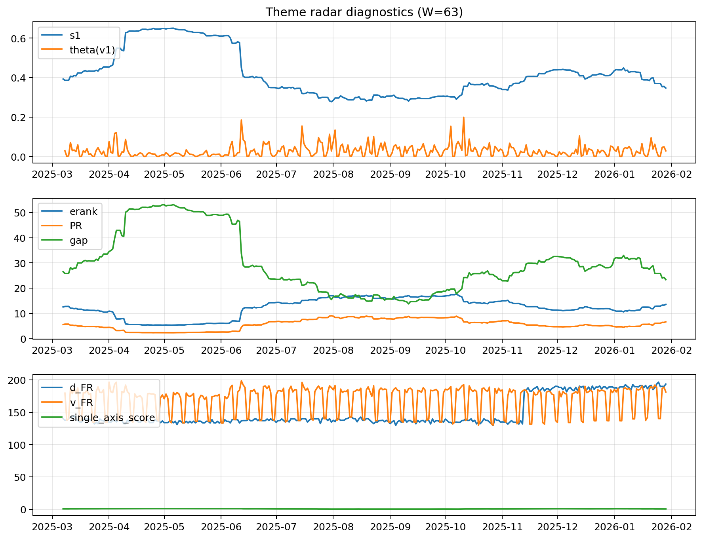

# Theme Radar Daily Brief — 2026-01-29

## Leaders (v1) — W=63
- **Nuclear_Uranium** (0.0863786355861805)
- Semis (0.0739124805603241)
- Grid_Power (0.0610041344400662)

## Challengers — W=63
**v2:** Rates (0.0834570652877515), MegaCap_AI (0.0793844250214684), Nuclear_Uranium (0.0782066110956813)
**v3:** Quantum (0.0902949481994045), Metals (0.0804279313030564), Rates (0.0639601148534441)

## Migration (20D slope) — W=63
**Top risers:**
- axis_Rates: 0.0007130820996355
- axis_Semis: 0.0004229342564812
- axis_Credit: 0.0002863670572675
- axis_Equity_ExUS: 0.0001895516603786
- axis_Equity_US: 0.0001791759380205
- axis_Robotics: 0.0001676454067745
- axis_Nuclear_Uranium: 0.0001544609565533
- axis_Grid_Power: 0.0001357973254946
- axis_Clean_Wind: 9.857262107747476e-05
- axis_Sector_Ind: 8.527425335457611e-05

**Top fallers:**
- axis_Sector_ConsDisc: -4.939966878900629e-05
- axis_Sector_Comm: -5.5329705737443154e-05
- axis_Cyber: -9.124185318034864e-05
- axis_USD: -0.000125465189474
- axis_Drones_Autonomy: -0.0001473900773843
- axis_Commodities: -0.0001478153498752
- axis_Quantum: -0.0002206359124322
- axis_Software_Cloud: -0.0005403685387271
- axis_Miners: -0.0005838354353482
- axis_Metals: -0.0009205529527452

## Risk line (W=63)
- s1: 0.3465686524264871
- theta_v1: 0.0282696850782848
- v_FR: 181.2879556762944
- single_axis_score: 0.3393939393939394

## Interpretation
**Regime:** `theme_migration`

- Action: Tomorrow watchlist: Rates, Semis, Credit, Equity_ExUS, Equity_US + v2_top1=Rates
- Action: Hedge note: normal correlation stability.

- Percentiles (W=63 history): vfr_pct=0.52, theta_pct=0.60, s1_pct=0.30, score_pct=0.35.

---
**BUNDLE_ROOT_SHA256:** `05b994f04cf9ad130328fe6a9deedce62e282f850d81a3b6ba4a1a6b0255fdde`
