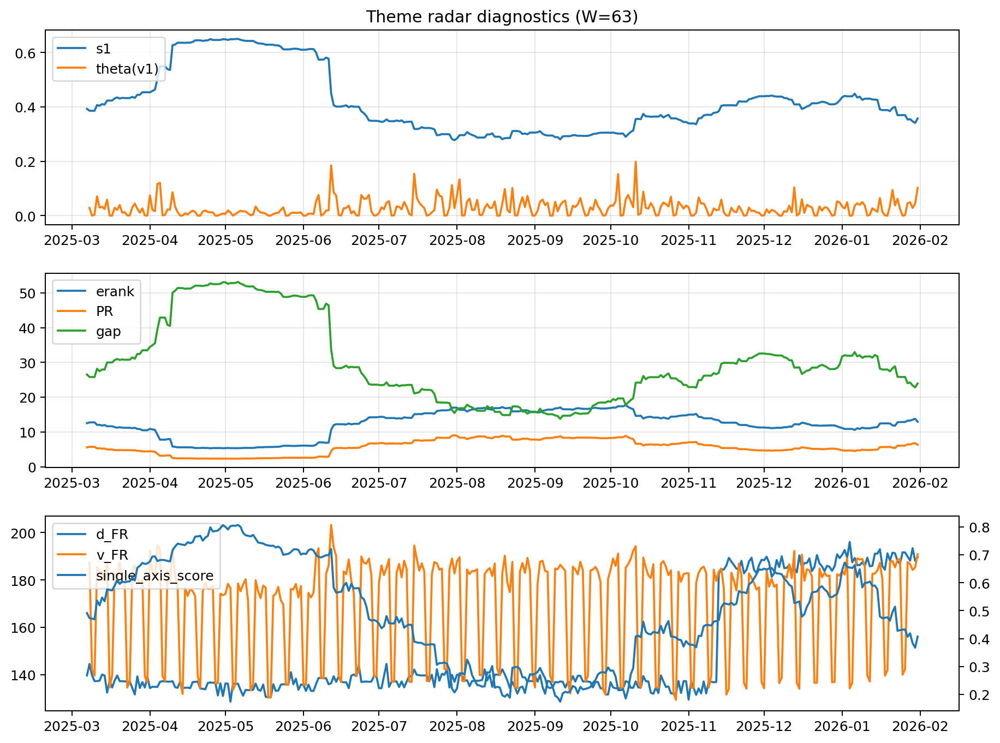

# Theme Radar Daily Brief — 2026-01-31

## Leaders (v1) — W=63
- **Nuclear_Uranium** (0.0885956488022216)
- Semis (0.0714128775857041)
- Space (0.0582476426844815)

## Challengers — W=63
**v2:** Metals (0.098093544740595), Rates (0.0901908466157654), Nuclear_Uranium (0.0689894265689169)
**v3:** Software_Cloud (0.0925331822951918), Metals (0.0645269075158356), Quantum (0.0624857229701759)

## Migration (20D slope) — W=63
**Top risers:**
- axis_Rates: 0.0006772867611372
- axis_Semis: 0.00040423316091
- axis_Credit: 0.000255237685852
- axis_Nuclear_Uranium: 0.0002055082467572
- axis_Equity_ExUS: 0.0001808160780577
- axis_Robotics: 0.0001715589448059
- axis_Equity_US: 0.0001684011250817
- axis_DataCenter_Infra: 0.0001344827331221
- axis_Clean_Wind: 0.0001119959541677
- axis_Crypto: 8.911747931677923e-05

**Top fallers:**
- axis_Sector_ConsDisc: -4.72955573111408e-05
- axis_Cyber: -8.801833322085248e-05
- axis_Drones_Autonomy: -0.0001173284604071
- axis_USD: -0.0001336914654023
- axis_Commodities: -0.000156282562752
- axis_Sector_Comm: -0.0001568335550792
- axis_Quantum: -0.0002285992063019
- axis_Software_Cloud: -0.0004780395306576
- axis_Miners: -0.0005628878118963
- axis_Metals: -0.0007208673083309

## Risk line (W=63)
- s1: 0.3574651754602319
- theta_v1: 0.1020724661836843
- v_FR: 190.88713132610897
- single_axis_score: 0.4072507552870091

## Interpretation
**Regime:** `structure_rewrite`

- Action: Tomorrow watchlist: Rates, Semis, Credit, Nuclear_Uranium, Equity_ExUS + v2_top1=Metals
- Action: Hedge note: v_FR high + theta high → correlation structure unstable; diversify hedges / reduce reliance on static correlations.

- Percentiles (W=63 history): vfr_pct=0.96, theta_pct=0.97, s1_pct=0.37, score_pct=0.31.

---
**BUNDLE_ROOT_SHA256:** `167ce05619f5698e7e2873263a9c27fb32af3d9676e8bde0cabfea6d480e3bb2`
