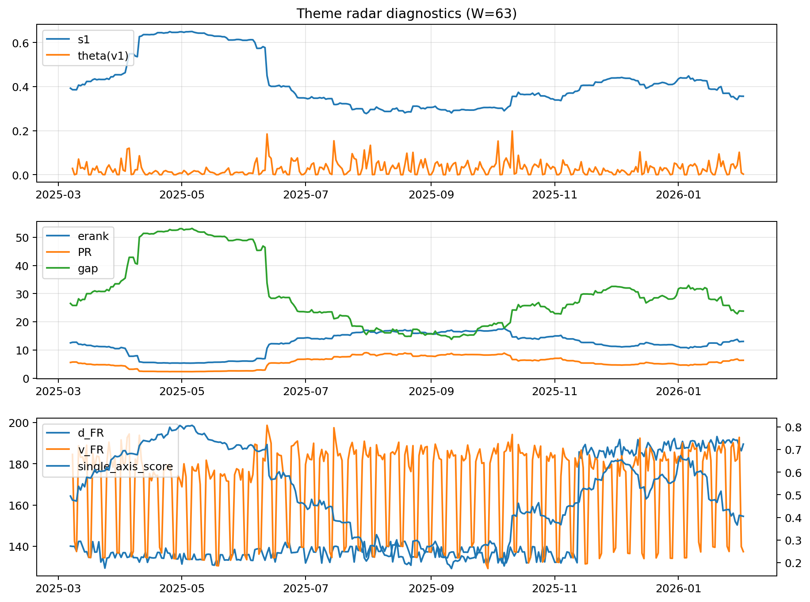

# Theme Radar Daily Brief — 2026-02-02

## Leaders (v1) — W=63
- **Nuclear_Uranium** (0.0888160494634824)
- Semis (0.071576688603604)
- Space (0.0584186253024636)

## Challengers — W=63
**v2:** Metals (0.098052176256322), Rates (0.089704451383893), Nuclear_Uranium (0.0688608448589798)
**v3:** Software_Cloud (0.0929333011380538), Metals (0.0657151879500033), Quantum (0.0625005419407098)

## Migration (20D slope) — W=63
**Top risers:**
- axis_Rates: 0.0005897849774534
- axis_Semis: 0.0003201773079533
- axis_Nuclear_Uranium: 0.0002524979603412
- axis_DataCenter_Infra: 0.0001777848442984
- axis_Credit: 0.00017645740751
- axis_Equity_ExUS: 0.0001567258267832
- axis_Robotics: 0.0001496352887204
- axis_Equity_US: 0.0001196869364274
- axis_Clean_Wind: 0.0001166430651335
- axis_Sector_ConsStap: 0.0001143723016873

**Top fallers:**
- axis_Sector_Fin: -8.208688263965819e-05
- axis_Sector_Health: -9.40843295771189e-05
- axis_USD: -9.759461311597328e-05
- axis_Cyber: -9.873256535532052e-05
- axis_Commodities: -0.0001263832021406
- axis_Quantum: -0.0001985485411071
- axis_Sector_Comm: -0.0002464182208767
- axis_Metals: -0.0003091675482753
- axis_Software_Cloud: -0.0003679486846579
- axis_Miners: -0.0004516581020471

## Risk line (W=63)
- s1: 0.356130887156962
- theta_v1: 0.0027807449605079
- v_FR: 137.36810505411705
- single_axis_score: 0.4048048048048048

## Interpretation
**Regime:** `theme_migration`

- Action: Tomorrow watchlist: Rates, Semis, Nuclear_Uranium, DataCenter_Infra, Credit + v2_top1=Metals
- Action: Hedge note: normal correlation stability.

- Percentiles (W=63 history): vfr_pct=0.20, theta_pct=0.25, s1_pct=0.37, score_pct=0.30.

---
**BUNDLE_ROOT_SHA256:** `1078a7dcb53a390171587fdf5abe9734d9aa828820c95661ed1a6db7fa212acf`
