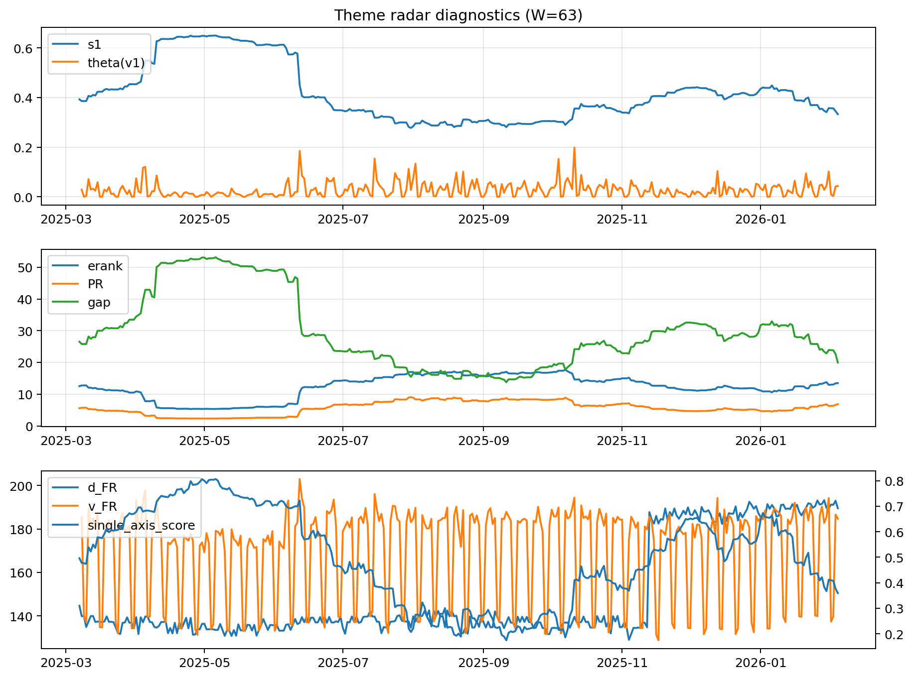

# Theme Radar Daily Brief — 2026-02-04

## Leaders (v1) — W=63
- **Nuclear_Uranium** (0.0907058924782155)
- Semis (0.0731578932068934)
- Space (0.0599284763829989)

## Challengers — W=63
**v2:** Metals (0.0770348631625507), MegaCap_AI (0.074651431466477), Nuclear_Uranium (0.0696601185667445)
**v3:** Quantum (0.0852828828669737), Rates (0.0750277003848747), Software_Cloud (0.0707169517221503)

## Migration (20D slope) — W=63
**Top risers:**
- axis_Rates: 0.0004483911155542
- axis_Nuclear_Uranium: 0.0003066787142277
- axis_Semis: 0.000252517037043
- axis_DataCenter_Infra: 0.0001845490869035
- axis_Robotics: 0.0001479374641292
- axis_Equity_ExUS: 0.0001450712901803
- axis_Sector_ConsStap: 0.0001448411253323
- axis_Metals: 0.000131551625662
- axis_Clean_Wind: 0.0001192362372682
- axis_Space: 8.880857134068919e-05

**Top fallers:**
- axis_Commodities: -9.157002181438342e-05
- axis_Quantum: -0.0001106193365236
- axis_Sector_RealEstate: -0.0001181112506931
- axis_Sector_Fin: -0.0001358818784708
- axis_Crypto: -0.0001380009020239
- axis_Cyber: -0.0001579740064189
- axis_Sector_Health: -0.0001828634808358
- axis_Miners: -0.0002839293764306
- axis_Software_Cloud: -0.0002952471287583
- axis_Sector_Comm: -0.0003200221421783

## Risk line (W=63)
- s1: 0.3328684139796086
- theta_v1: 0.0433650380366399
- v_FR: 184.7265126193777
- single_axis_score: 0.3594029850746268

## Interpretation
**Regime:** `theme_migration`

- Action: Tomorrow watchlist: Rates, Nuclear_Uranium, Semis, DataCenter_Infra, Robotics + v2_top1=Metals
- Action: Hedge note: normal correlation stability.

- Percentiles (W=63 history): vfr_pct=0.72, theta_pct=0.78, s1_pct=0.27, score_pct=0.24.

---
**BUNDLE_ROOT_SHA256:** `b922a989efe6b58bfe131598b2d4ccb9363ca7d0cebb082afd689e5336561337`
