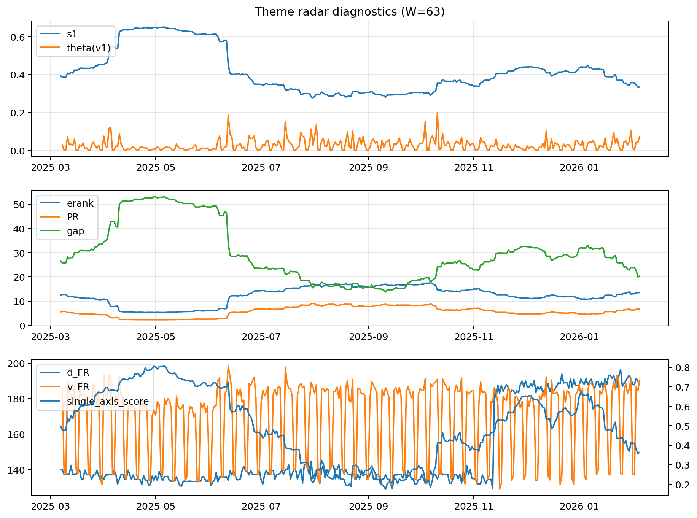

# Theme Radar Daily Brief — 2026-02-05

## Leaders (v1) — W=63
- **Nuclear_Uranium** (0.0936808849174516)
- Semis (0.0755669214302146)
- Space (0.0607699814132979)

## Challengers — W=63
**v2:** Metals (0.0789263542458155), MegaCap_AI (0.0743813930326627), Software_Cloud (0.066605860790929)
**v3:** Quantum (0.0809752288057935), Rates (0.0788309164283025), Software_Cloud (0.0639747809245419)

## Migration (20D slope) — W=63
**Top risers:**
- axis_Nuclear_Uranium: 0.0003889901268509
- axis_Metals: 0.0003406582601691
- axis_Rates: 0.0003016750661514
- axis_Semis: 0.0002633129752185
- axis_Sector_ConsStap: 0.0001715237345066
- axis_Space: 0.0001628030532918
- axis_Robotics: 0.0001578815876078
- axis_Equity_ExUS: 0.0001508058928364
- axis_DataCenter_Infra: 0.0001369771457417
- axis_Clean_Wind: 0.0001147725278878

**Top fallers:**
- axis_Commodities: -7.680377084424655e-05
- axis_Grid_Power: -8.759225932968454e-05
- axis_Miners: -0.0001763040353658
- axis_Sector_Fin: -0.0001793320161611
- axis_Sector_RealEstate: -0.0001871583949358
- axis_Cyber: -0.0002188598964413
- axis_Sector_Health: -0.0002347328537236
- axis_Crypto: -0.0002540148388942
- axis_Software_Cloud: -0.0003041379135924
- axis_Sector_Comm: -0.0003505899035571

## Risk line (W=63)
- s1: 0.3332785783079904
- theta_v1: 0.0721093181512333
- v_FR: 188.68103585120787
- single_axis_score: 0.3019287833827893

## Interpretation
**Regime:** `theme_migration`

- Action: Tomorrow watchlist: Nuclear_Uranium, Metals, Rates, Semis, Sector_ConsStap + v2_top1=Metals
- Action: Hedge note: normal correlation stability.

- Percentiles (W=63 history): vfr_pct=0.89, theta_pct=0.92, s1_pct=0.27, score_pct=0.28.

---
**BUNDLE_ROOT_SHA256:** `479fe70f4e5ebdbb68379feb4152dc9d617d0f3e823544374a0070a36a32be68`
