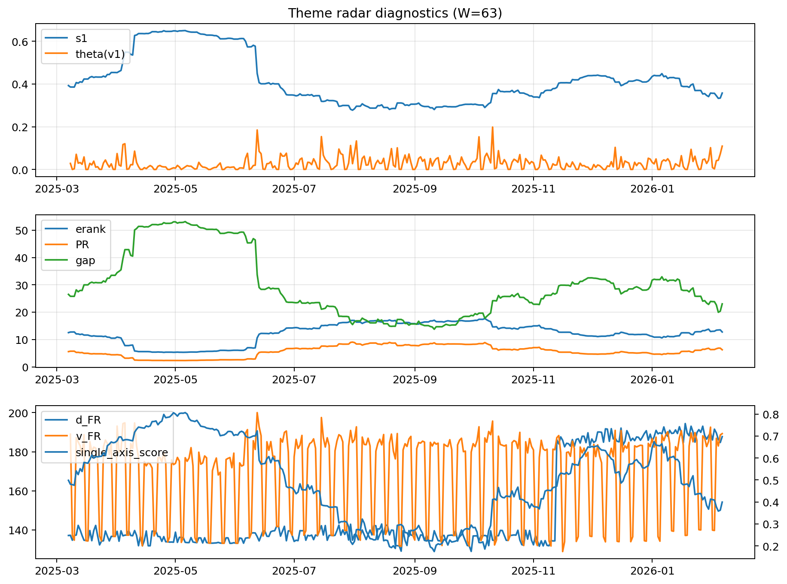

# Theme Radar Daily Brief — 2026-02-06

## Leaders (v1) — W=63
- **Nuclear_Uranium** (0.0903531389718864)
- Semis (0.0669175609630672)
- Space (0.0587320813570285)

## Challengers — W=63
**v2:** Metals (0.0843271123149793), MegaCap_AI (0.0662038641863917), Semis (0.0635538929612686)
**v3:** Software_Cloud (0.0965120092120805), Rates (0.0751617689594531), Grid_Power (0.0729667484262179)

## Migration (20D slope) — W=63
**Top risers:**
- axis_Metals: 0.0006088443208426
- axis_Nuclear_Uranium: 0.0004126142329528
- axis_Critical_Minerals: 0.0002339715225238
- axis_Space: 0.0002020414145505
- axis_Sector_ConsStap: 0.0001767422086826
- axis_Robotics: 0.000153591011284
- axis_Semis: 0.0001448836633921
- axis_Equity_ExUS: 0.0001361424942654
- axis_Clean_Wind: 0.0001130129717933
- axis_USD: 6.800376745922209e-05

**Top fallers:**
- axis_Sector_Ind: -9.45717118258439e-05
- axis_Credit: -0.0001118788062358
- axis_Crypto: -0.0001849049769181
- axis_Grid_Power: -0.000204677554878
- axis_Sector_Fin: -0.0002067354631127
- axis_Sector_RealEstate: -0.0002395089918593
- axis_Cyber: -0.0002494538746156
- axis_Software_Cloud: -0.0002581903132469
- axis_Sector_Health: -0.0002642500996118
- axis_Sector_Comm: -0.0003818792074842

## Risk line (W=63)
- s1: 0.3575881889011712
- theta_v1: 0.1092985852557005
- v_FR: 189.2919619352318
- single_axis_score: 0.399406528189911

## Interpretation
**Regime:** `structure_rewrite`

- Action: Tomorrow watchlist: Metals, Nuclear_Uranium, Critical_Minerals, Space, Sector_ConsStap + v2_top1=Metals
- Action: Hedge note: v_FR high + theta high → correlation structure unstable; diversify hedges / reduce reliance on static correlations.

- Percentiles (W=63 history): vfr_pct=0.93, theta_pct=0.98, s1_pct=0.38, score_pct=0.30.

---
**BUNDLE_ROOT_SHA256:** `714099ab88e466d4c9422c35334aaaefe5969a5b82337855e9e0c0d68a9cc378`
