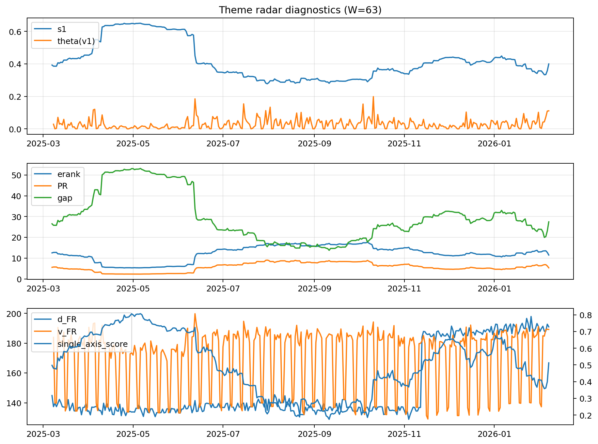

# Theme Radar Daily Brief — 2026-02-07

## Leaders (v1) — W=63
- **Nuclear_Uranium** (0.0859558305444379)
- Semis (0.0667869264228896)
- Quantum (0.0575950000495428)

## Challengers — W=63
**v2:** Metals (0.0924415176762703), Rates (0.0629952355647869), Nuclear_Uranium (0.0609491876191552)
**v3:** Software_Cloud (0.0961251415580117), Rates (0.0834839070450588), Genomics_Bio (0.0719290925786359)

## Migration (20D slope) — W=63
**Top risers:**
- axis_Metals: 0.0008453549795619
- axis_Nuclear_Uranium: 0.0003667096553842
- axis_Critical_Minerals: 0.0003522042498114
- axis_Space: 0.0001978321725805
- axis_Quantum: 0.0001632080899961
- axis_Genomics_Bio: 0.0001449316021479
- axis_Sector_ConsStap: 0.0001417286023751
- axis_USD: 0.0001365825053146
- axis_Robotics: 0.0001351840063481
- axis_Equity_ExUS: 0.0001171332251557

**Top fallers:**
- axis_MegaCap_AI: -0.0001356873346174
- axis_Software_Cloud: -0.000164652159856
- axis_Sector_Fin: -0.0002126755379902
- axis_Credit: -0.0002359974295163
- axis_Sector_RealEstate: -0.0002458055489765
- axis_Cyber: -0.0002475348911492
- axis_Sector_Health: -0.0002530126740898
- axis_Rates: -0.0002544845866692
- axis_Grid_Power: -0.0002756878266773
- axis_Sector_Comm: -0.0004254172912362

## Risk line (W=63)
- s1: 0.3994248900216077
- theta_v1: 0.111038841830292
- v_FR: 189.19384075522305
- single_axis_score: 0.5124260355029586

## Interpretation
**Regime:** `structure_rewrite`

- Action: Tomorrow watchlist: Metals, Nuclear_Uranium, Critical_Minerals, Space, Quantum + v2_top1=Metals
- Action: Hedge note: v_FR high + theta high → correlation structure unstable; diversify hedges / reduce reliance on static correlations.

- Percentiles (W=63 history): vfr_pct=0.92, theta_pct=0.98, s1_pct=0.51, score_pct=0.50.

---
**BUNDLE_ROOT_SHA256:** `d1c36f14fc4bde6ad5cfcca596148bb0e87f0f07513f392efbe7b6af9da41954`
