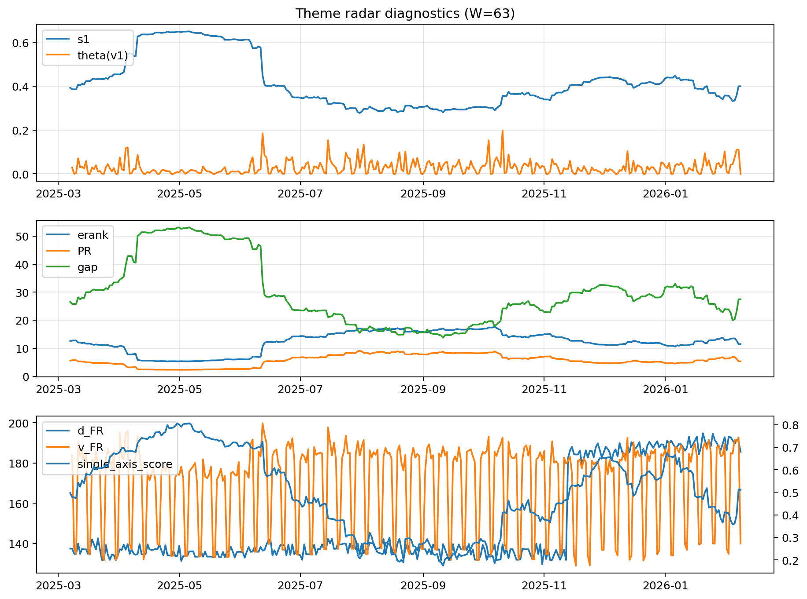

# Theme Radar Daily Brief — 2026-02-08

## Leaders (v1) — W=63
- **Nuclear_Uranium** (0.0859593005751846)
- Semis (0.0667897410036739)
- Quantum (0.0575950634991516)

## Challengers — W=63
**v2:** Metals (0.092443814260711), Rates (0.0630188813452134), Nuclear_Uranium (0.0609447550944557)
**v3:** Software_Cloud (0.0961623912063438), Rates (0.083459846687934), Genomics_Bio (0.0719599882492653)

## Migration (20D slope) — W=63
**Top risers:**
- axis_Metals: 0.0010710081565906
- axis_Critical_Minerals: 0.0004630017800922
- axis_Nuclear_Uranium: 0.0003198539701189
- axis_Quantum: 0.0002674949125833
- axis_Miners: 0.0002309749763679
- axis_Genomics_Bio: 0.0002250700465008
- axis_USD: 0.0002044809804767
- axis_Space: 0.000197017289618
- axis_Drones_Autonomy: 0.0001369420290188
- axis_Robotics: 0.0001143442966792

**Top fallers:**
- axis_Sector_Ind: -0.0001374939895357
- axis_Sector_Fin: -0.0002150097304935
- axis_Sector_Health: -0.0002398146207484
- axis_Cyber: -0.0002415061362231
- axis_Sector_RealEstate: -0.0002501739983227
- axis_MegaCap_AI: -0.0002607285881615
- axis_Grid_Power: -0.0003374384016639
- axis_Credit: -0.0003556454444814
- axis_Sector_Comm: -0.00046048070228
- axis_Rates: -0.0005369274146077

## Risk line (W=63)
- s1: 0.3994030085452586
- theta_v1: 0.0002019615718716
- v_FR: 140.03241256549353
- single_axis_score: 0.5109144542772861

## Interpretation
**Regime:** `theme_migration`

- Action: Tomorrow watchlist: Metals, Critical_Minerals, Nuclear_Uranium, Quantum, Miners + v2_top1=Metals
- Action: Hedge note: normal correlation stability.

- Percentiles (W=63 history): vfr_pct=0.28, theta_pct=0.09, s1_pct=0.51, score_pct=0.50.

---
**BUNDLE_ROOT_SHA256:** `c90d2ac5c4a5b4933f140b9c33ef0b5c2b1ac9173efdd25602e1461c0ffc7360`
