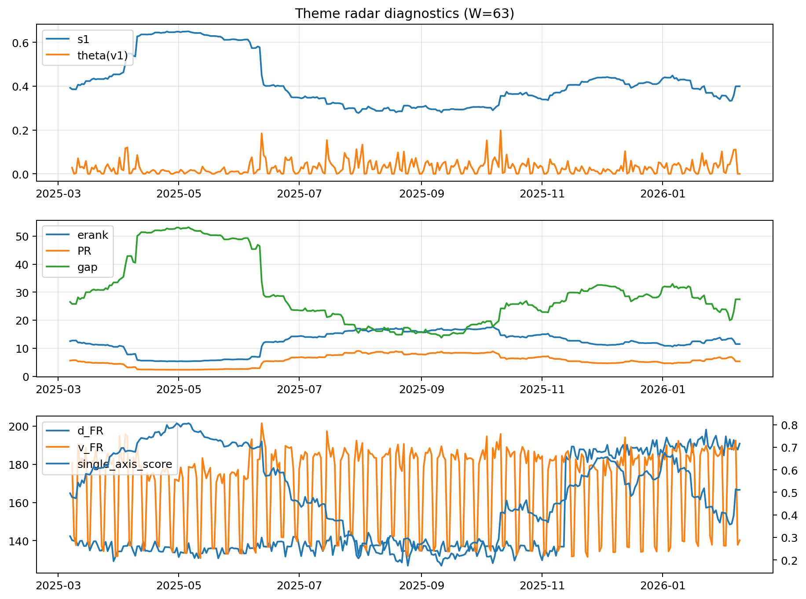

# Theme Radar Daily Brief — 2026-02-09

## Leaders (v1) — W=63
- **Nuclear_Uranium** (0.085958649583277)
- Semis (0.0667896963367571)
- Quantum (0.0575942401184197)

## Challengers — W=63
**v2:** Metals (0.0924448852153444), Rates (0.0630255866072918), Nuclear_Uranium (0.0609449354759851)
**v3:** Software_Cloud (0.0961736665536897), Rates (0.0834533144263211), Genomics_Bio (0.0719702719303151)

## Migration (20D slope) — W=63
**Top risers:**
- axis_Metals: 0.0012728839935704
- axis_Critical_Minerals: 0.0005839839295886
- axis_Quantum: 0.0003775044721318
- axis_Miners: 0.0003643976265169
- axis_Genomics_Bio: 0.0003403177259166
- axis_Nuclear_Uranium: 0.000273041916727
- axis_USD: 0.0002642400176421
- axis_Space: 0.0001947266672729
- axis_Drones_Autonomy: 0.0001693921742561
- axis_Crypto: 0.0001132523182532

**Top fallers:**
- axis_Semis: -0.0001784488917589
- axis_Sector_Fin: -0.0002216952194338
- axis_Sector_Health: -0.0002226047571541
- axis_Cyber: -0.0002413954140843
- axis_Sector_RealEstate: -0.0002600716677077
- axis_MegaCap_AI: -0.0003790985967762
- axis_Grid_Power: -0.0003918870205707
- axis_Credit: -0.0004686108408766
- axis_Sector_Comm: -0.0004862940494904
- axis_Rates: -0.000799958575894

## Risk line (W=63)
- s1: 0.3994077474312142
- theta_v1: 0.0001190515710485
- v_FR: 140.20100880565042
- single_axis_score: 0.5111764705882353

## Interpretation
**Regime:** `theme_migration`

- Action: Tomorrow watchlist: Metals, Critical_Minerals, Quantum, Miners, Genomics_Bio + v2_top1=Metals
- Action: Hedge note: normal correlation stability.

- Percentiles (W=63 history): vfr_pct=0.26, theta_pct=0.06, s1_pct=0.51, score_pct=0.50.

---
**BUNDLE_ROOT_SHA256:** `8061bdc75c31d055d504fd1b27046c1afd491ec6ffa3e77e2c64d684aed69c5f`
