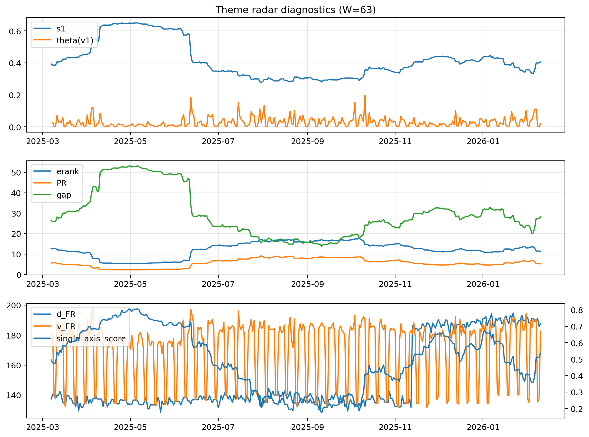

# Theme Radar Daily Brief — 2026-02-10

## Leaders (v1) — W=63
- **Nuclear_Uranium** (0.0856093597241305)
- Semis (0.0666485240931828)
- Quantum (0.0569491617604702)

## Challengers — W=63
**v2:** Metals (0.0926185354609519), Rates (0.0655046867040158), Semis (0.0625182804568026)
**v3:** Software_Cloud (0.0979031967880527), Genomics_Bio (0.0775220968030022), Rates (0.0742315052000233)

## Migration (20D slope) — W=63
**Top risers:**
- axis_Metals: 0.0013192368195343
- axis_Critical_Minerals: 0.0006371852418422
- axis_Quantum: 0.0004621880824801
- axis_Miners: 0.0004293466257988
- axis_Genomics_Bio: 0.00038809939288
- axis_USD: 0.0002780232168743
- axis_Crypto: 0.0002348005900768
- axis_Drones_Autonomy: 0.0002116053684725
- axis_Nuclear_Uranium: 0.0001896639084744
- axis_Space: 0.0001782853038219

**Top fallers:**
- axis_Sector_Health: -0.000210179262671
- axis_Cyber: -0.0002110031068877
- axis_Sector_Fin: -0.0002217256632308
- axis_Sector_RealEstate: -0.0002365438248666
- axis_Semis: -0.0002636116829523
- axis_MegaCap_AI: -0.0003990119312443
- axis_Grid_Power: -0.0004431369186906
- axis_Sector_Comm: -0.0004712867976423
- axis_Credit: -0.0005372595303181
- axis_Rates: -0.0009728462606776

## Risk line (W=63)
- s1: 0.4062214161740219
- theta_v1: 0.0196411338033945
- v_FR: 182.66446182664987
- single_axis_score: 0.5366568914956013

## Interpretation
**Regime:** `theme_migration`

- Action: Tomorrow watchlist: Metals, Critical_Minerals, Quantum, Miners, Genomics_Bio + v2_top1=Metals
- Action: Hedge note: normal correlation stability.

- Percentiles (W=63 history): vfr_pct=0.60, theta_pct=0.49, s1_pct=0.57, score_pct=0.54.

---
**BUNDLE_ROOT_SHA256:** `e1cc401c5a28e16f34209a9a7bdf4c90038345773bab0084c75ef40aca821995`
