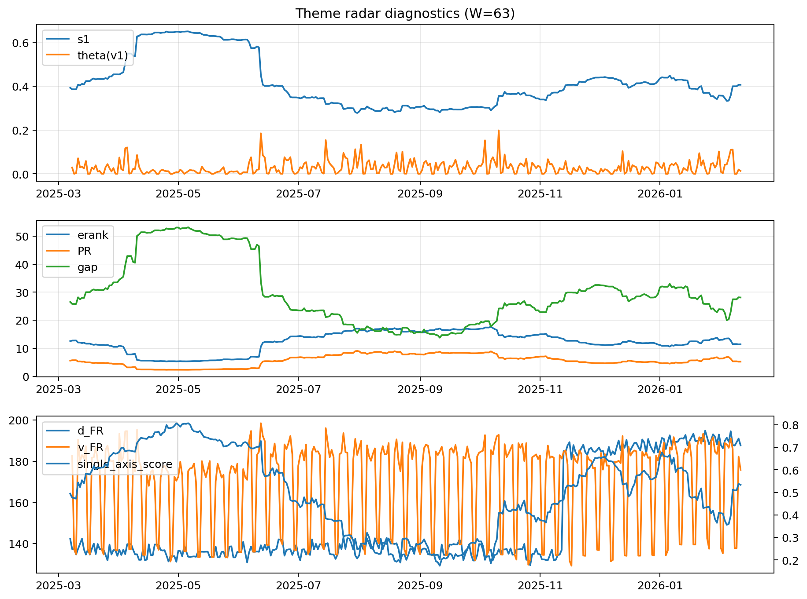

# Theme Radar Daily Brief — 2026-02-11

## Leaders (v1) — W=63
- **Nuclear_Uranium** (0.0858607884843392)
- Semis (0.0666205572183164)
- Quantum (0.0571246020823673)

## Challengers — W=63
**v2:** Metals (0.0906330737620507), Rates (0.0677360864732832), Semis (0.0620549727693487)
**v3:** Software_Cloud (0.0956370597517224), Genomics_Bio (0.0854418560361697), Rates (0.0733559065239612)

## Migration (20D slope) — W=63
**Top risers:**
- axis_Metals: 0.0013390355778112
- axis_Critical_Minerals: 0.0006922775859344
- axis_Quantum: 0.0005034457616061
- axis_Miners: 0.000483766458327
- axis_Genomics_Bio: 0.0004565616387316
- axis_Crypto: 0.0003713588919956
- axis_USD: 0.0002878041995396
- axis_Drones_Autonomy: 0.0002156259090181
- axis_Software_Cloud: 0.0001907425413251
- axis_Commodities: 0.0001607041192793

**Top fallers:**
- axis_Cyber: -0.0001845874382106
- axis_Sector_Ind: -0.0001848960924804
- axis_Sector_RealEstate: -0.000212050361011
- axis_Sector_Fin: -0.0002172543951207
- axis_Semis: -0.0003536446904895
- axis_MegaCap_AI: -0.0004045767030677
- axis_Sector_Comm: -0.000442152492581
- axis_Grid_Power: -0.0004867977646891
- axis_Credit: -0.000590646513986
- axis_Rates: -0.0011098846505707

## Risk line (W=63)
- s1: 0.4061742347657314
- theta_v1: 0.0133188069171996
- v_FR: 175.76732461197
- single_axis_score: 0.5333333333333333

## Interpretation
**Regime:** `theme_migration`

- Action: Tomorrow watchlist: Metals, Critical_Minerals, Quantum, Miners, Genomics_Bio + v2_top1=Metals
- Action: Hedge note: normal correlation stability.

- Percentiles (W=63 history): vfr_pct=0.36, theta_pct=0.41, s1_pct=0.57, score_pct=0.53.

---
**BUNDLE_ROOT_SHA256:** `cd05631d1508d4f75911f489bf0daeb72910bff8a7bcc19f7cd6ea59ab5025c4`
