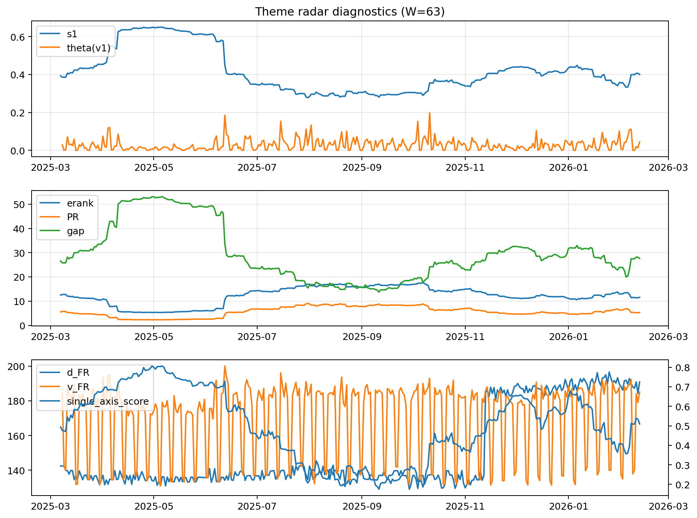

# Theme Radar Daily Brief — 2026-02-12

## Leaders (v1) — W=63
- **Nuclear_Uranium** (0.0870128693639639)
- Semis (0.0660616363546275)
- Quantum (0.0586663732086114)

## Challengers — W=63
**v2:** Metals (0.0929062800308902), MegaCap_AI (0.0624454256089458), Rates (0.0623741131492321)
**v3:** Genomics_Bio (0.0883132216697955), Software_Cloud (0.0864371981675723), Grid_Power (0.0829771099039737)

## Migration (20D slope) — W=63
**Top risers:**
- axis_Metals: 0.0013391225195623
- axis_Critical_Minerals: 0.0006883750919513
- axis_Genomics_Bio: 0.000544144125713
- axis_Quantum: 0.0005360108443244
- axis_Miners: 0.0005008430182486
- axis_Crypto: 0.0004609745989031
- axis_USD: 0.0002873618594083
- axis_Software_Cloud: 0.0002411649059642
- axis_Drones_Autonomy: 0.0002286084388029
- axis_Commodities: 0.0001661825520873

**Top fallers:**
- axis_Sector_RealEstate: -0.000187289124619
- axis_Sector_Ind: -0.0001906850284494
- axis_Equity_US: -0.000192164727148
- axis_Sector_Fin: -0.0002066464711109
- axis_Sector_Comm: -0.000411001499985
- axis_MegaCap_AI: -0.0004151266849708
- axis_Semis: -0.0004206955340091
- axis_Grid_Power: -0.000532945698151
- axis_Credit: -0.0005851301202562
- axis_Rates: -0.0010889204286559

## Risk line (W=63)
- s1: 0.4003950397492977
- theta_v1: 0.0438843263266954
- v_FR: 185.00159325857945
- single_axis_score: 0.5096209912536442

## Interpretation
**Regime:** `theme_migration`

- Action: Tomorrow watchlist: Metals, Critical_Minerals, Genomics_Bio, Quantum, Miners + v2_top1=Metals
- Action: Hedge note: normal correlation stability.

- Percentiles (W=63 history): vfr_pct=0.75, theta_pct=0.78, s1_pct=0.51, score_pct=0.50.

---
**BUNDLE_ROOT_SHA256:** `c04d8ba6e23e4250da51247490c43f4d33878df47c9d169e4693cc8848ff4e87`
