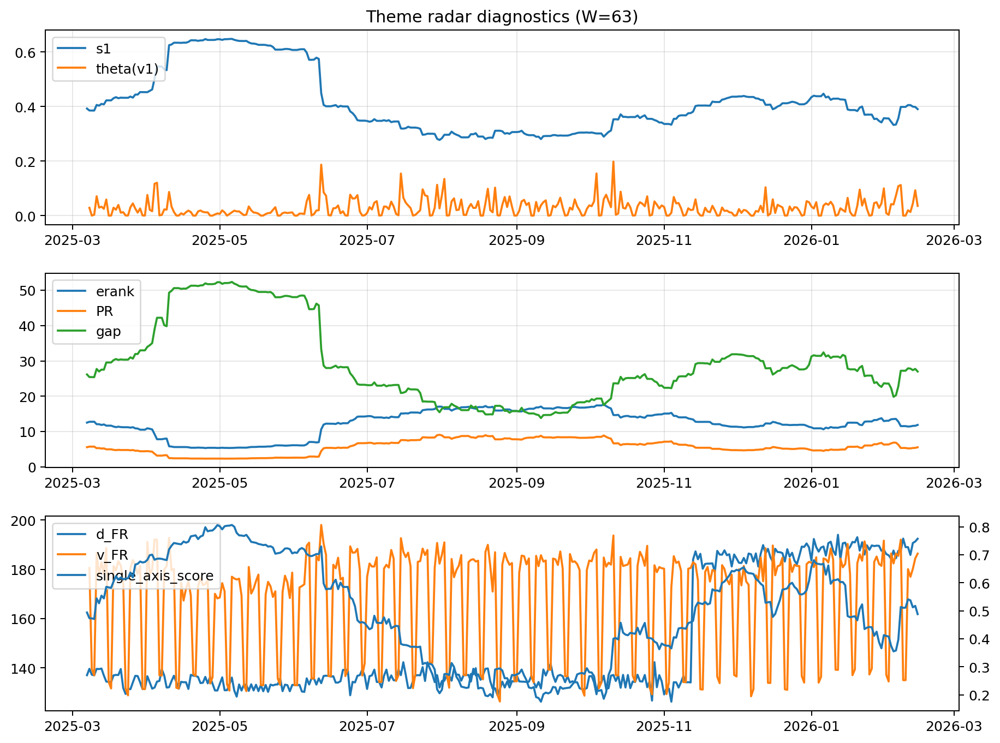

# Theme Radar Daily Brief — 2026-02-14

## Leaders (v1) — W=63
- **Nuclear_Uranium** (0.0875872814230178)
- Semis (0.0673407373023771)
- Quantum (0.061417305557612)

## Challengers — W=63
**v2:** Metals (0.0903311917550673), Rates (0.0736029446955591), Nuclear_Uranium (0.0648497538248389)
**v3:** Software_Cloud (0.0862779321703886), Grid_Power (0.0802110014263677), DataCenter_Infra (0.0793354767129579)

## Migration (20D slope) — W=63
**Top risers:**
- axis_Metals: 0.0013504184186392
- axis_Critical_Minerals: 0.0006859272996869
- axis_Crypto: 0.0006592764122811
- axis_Genomics_Bio: 0.0006371908968665
- axis_Quantum: 0.0005975231189254
- axis_Miners: 0.0003850809509496
- axis_Software_Cloud: 0.0003505242524792
- axis_USD: 0.000268126201822
- axis_Drones_Autonomy: 0.0002376706133172
- axis_Commodities: 0.0002077842383592

**Top fallers:**
- axis_Sector_Ind: -0.0001840475293296
- axis_Space: -0.0001878853565123
- axis_Sector_Utilities: -0.0001893298323861
- axis_DataCenter_Infra: -0.0002616838838032
- axis_Sector_Comm: -0.0002930056562887
- axis_MegaCap_AI: -0.000353702670963
- axis_Semis: -0.0004567939094362
- axis_Grid_Power: -0.0005794639341603
- axis_Credit: -0.0005849049980215
- axis_Rates: -0.0010697863552183

## Risk line (W=63)
- s1: 0.3904696638048961
- theta_v1: 0.0355288767142464
- v_FR: 186.3731260134813
- single_axis_score: 0.4881159420289854

## Interpretation
**Regime:** `theme_migration`

- Action: Tomorrow watchlist: Metals, Critical_Minerals, Crypto, Genomics_Bio, Quantum + v2_top1=Metals
- Action: Hedge note: normal correlation stability.

- Percentiles (W=63 history): vfr_pct=0.88, theta_pct=0.70, s1_pct=0.49, score_pct=0.48.

---
**BUNDLE_ROOT_SHA256:** `7943b7c09a72def9683a4263a3386a996f72f9c45b57a9f87af8039fef32ea28`
