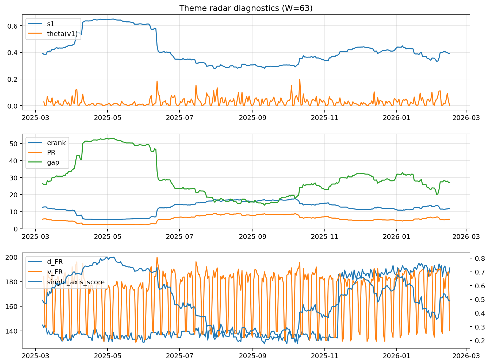

# Theme Radar Daily Brief — 2026-02-15

## Leaders (v1) — W=63
- **Nuclear_Uranium** (0.0865425409568001)
- Semis (0.0661226377635664)
- Quantum (0.0604476351001379)

## Challengers — W=63
**v2:** Metals (0.0912825690885406), Rates (0.0685404527853376), Software_Cloud (0.0617803495140819)
**v3:** Software_Cloud (0.0859590803132395), Grid_Power (0.0801470421076859), DataCenter_Infra (0.0793540559446271)

## Migration (20D slope) — W=63
**Top risers:**
- axis_Metals: 0.0012807275042383
- axis_Crypto: 0.0007241389783181
- axis_Genomics_Bio: 0.0006539863908294
- axis_Critical_Minerals: 0.0006300368173604
- axis_Quantum: 0.0006042697253434
- axis_Miners: 0.0005084971663067
- axis_Software_Cloud: 0.000380893923888
- axis_USD: 0.0002545506683782
- axis_Drones_Autonomy: 0.0002346735102782
- axis_Commodities: 0.0002115816717118

**Top fallers:**
- axis_Equity_US: -0.0001845345394714
- axis_Sector_Utilities: -0.0001882775431359
- axis_Sector_Comm: -0.000218998466236
- axis_Space: -0.0002999172142449
- axis_MegaCap_AI: -0.0003230906466003
- axis_DataCenter_Infra: -0.0004335271684636
- axis_Semis: -0.0005000749940415
- axis_Credit: -0.0005751207980859
- axis_Grid_Power: -0.0005891755222234
- axis_Rates: -0.0010244757721625

## Risk line (W=63)
- s1: 0.3914386203912671
- theta_v1: 0.0003893021442759
- v_FR: 140.13059450035033
- single_axis_score: 0.4872832369942196

## Interpretation
**Regime:** `theme_migration`

- Action: Tomorrow watchlist: Metals, Crypto, Genomics_Bio, Critical_Minerals, Quantum + v2_top1=Metals
- Action: Hedge note: normal correlation stability.

- Percentiles (W=63 history): vfr_pct=0.27, theta_pct=0.14, s1_pct=0.48, score_pct=0.48.

---
**BUNDLE_ROOT_SHA256:** `af8e108c6ecfaa1526603cfbb8f3f99bc07022814ba61bd196361396b97ddd80`
