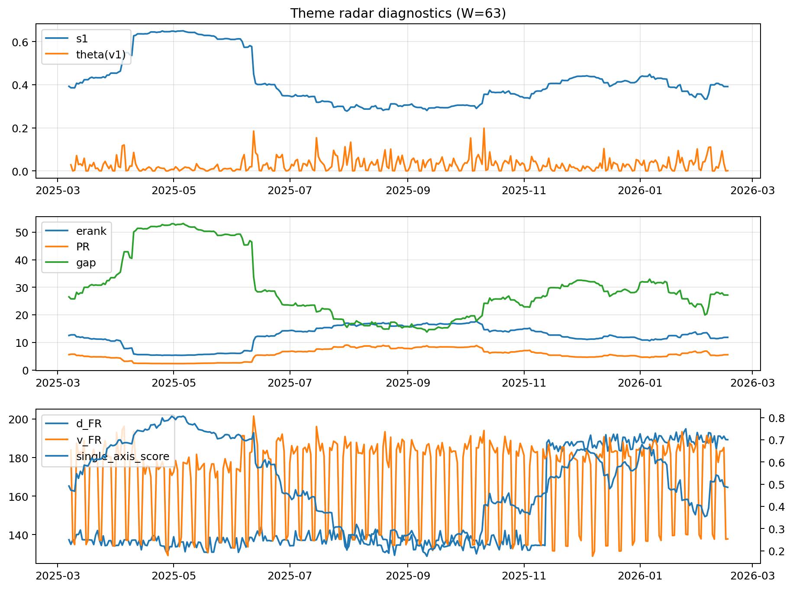

# Theme Radar Daily Brief — 2026-02-16

## Leaders (v1) — W=63
- **Nuclear_Uranium** (0.0865556810946895)
- Semis (0.0661324736051459)
- Quantum (0.0604511826829278)

## Challengers — W=63
**v2:** Metals (0.0913013390500605), Rates (0.0685939804665464), Software_Cloud (0.0617381364691744)
**v3:** Software_Cloud (0.086037360698986), Grid_Power (0.0801355067927153), DataCenter_Infra (0.0793902186803917)

## Migration (20D slope) — W=63
**Top risers:**
- axis_Metals: 0.0011853770437134
- axis_Crypto: 0.0007648390720934
- axis_Genomics_Bio: 0.0006624604619711
- axis_Critical_Minerals: 0.0006015948919595
- axis_Quantum: 0.0005701837970617
- axis_Miners: 0.0004704147287343
- axis_Software_Cloud: 0.0003909248744955
- axis_USD: 0.0002326410299398
- axis_Drones_Autonomy: 0.0002271084692412
- axis_Commodities: 0.0002015802502157

**Top fallers:**
- axis_Nuclear_Uranium: -0.0001509558889
- axis_Equity_US: -0.0001650646329208
- axis_Sector_Utilities: -0.0001931623292957
- axis_MegaCap_AI: -0.0003451923900468
- axis_Space: -0.0004018021488001
- axis_Semis: -0.0005011123963511
- axis_Credit: -0.0005467614533896
- axis_Grid_Power: -0.0005481212942372
- axis_DataCenter_Infra: -0.000579455709856
- axis_Rates: -0.0009596098424304

## Risk line (W=63)
- s1: 0.3913539630412863
- theta_v1: 0.0011367253271291
- v_FR: 137.7815564773031
- single_axis_score: 0.4858789625360231

## Interpretation
**Regime:** `theme_migration`

- Action: Tomorrow watchlist: Metals, Crypto, Genomics_Bio, Critical_Minerals, Quantum + v2_top1=Metals
- Action: Hedge note: normal correlation stability.

- Percentiles (W=63 history): vfr_pct=0.23, theta_pct=0.20, s1_pct=0.48, score_pct=0.48.

---
**BUNDLE_ROOT_SHA256:** `c7a892ac03c7b5b0e20aec80161be9c12401747dbd60d5d7deb129b6a1c214f8`
