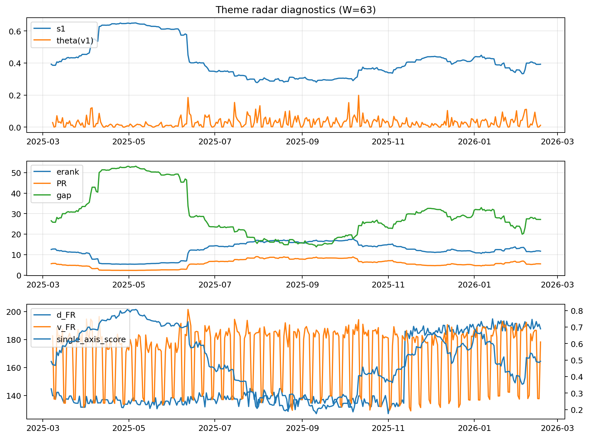

# Theme Radar Daily Brief — 2026-02-17

## Leaders (v1) — W=63
- **Nuclear_Uranium** (0.0861887512041399)
- Semis (0.066144541355958)
- Quantum (0.060341482912778)

## Challengers — W=63
**v2:** Metals (0.0896478185095672), Rates (0.0673082963477915), Software_Cloud (0.0626219469002972)
**v3:** Software_Cloud (0.0847668046125834), Grid_Power (0.0772230839040764), DataCenter_Infra (0.0771124975133825)

## Migration (20D slope) — W=63
**Top risers:**
- axis_Metals: 0.0010625491795299
- axis_Crypto: 0.0008051647538295
- axis_Genomics_Bio: 0.0006319113173119
- axis_Critical_Minerals: 0.0005530334690553
- axis_Quantum: 0.0005353028828108
- axis_Miners: 0.000427354170668
- axis_Software_Cloud: 0.0003480633150722
- axis_Drones_Autonomy: 0.0002206084393961
- axis_Commodities: 0.0002186230582349
- axis_USD: 0.00020419912703

**Top fallers:**
- axis_Equity_US: -0.0001460092905835
- axis_Nuclear_Uranium: -0.0001632179097408
- axis_Sector_Utilities: -0.0001777334263607
- axis_MegaCap_AI: -0.0003396342830106
- axis_Semis: -0.0004768427375954
- axis_Space: -0.0004858261566695
- axis_Grid_Power: -0.0004907616333038
- axis_Credit: -0.0005150739927285
- axis_DataCenter_Infra: -0.0006678923575272
- axis_Rates: -0.0009169622618037

## Risk line (W=63)
- s1: 0.392252651282969
- theta_v1: 0.0116816542710692
- v_FR: 178.25126982798355
- single_axis_score: 0.4925287356321839

## Interpretation
**Regime:** `theme_migration`

- Action: Tomorrow watchlist: Metals, Crypto, Genomics_Bio, Critical_Minerals, Quantum + v2_top1=Metals
- Action: Hedge note: normal correlation stability.

- Percentiles (W=63 history): vfr_pct=0.41, theta_pct=0.37, s1_pct=0.49, score_pct=0.49.

---
**BUNDLE_ROOT_SHA256:** `35becbf18ec1620bd241a23075cef7684f0ad08c569016745972d23db3095fcc`
