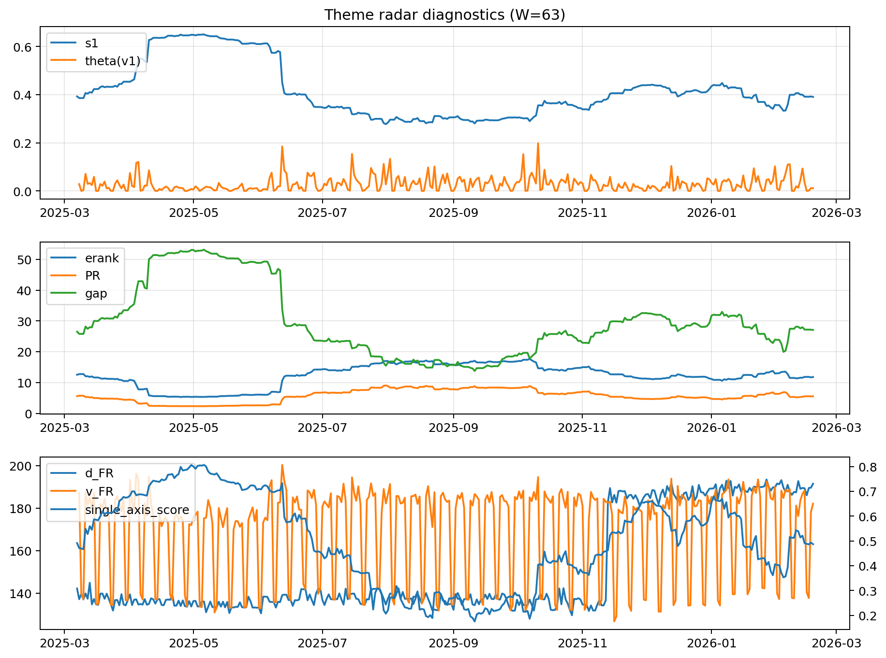

# Theme Radar Daily Brief — 2026-02-18

## Leaders (v1) — W=63
- **Nuclear_Uranium** (0.0864406512807592)
- Semis (0.0661857934974081)
- Quantum (0.0615051415007358)

## Challengers — W=63
**v2:** Metals (0.0931950381621728), Rates (0.0677902181722426), Nuclear_Uranium (0.0617496636389751)
**v3:** Software_Cloud (0.0896895648666765), Genomics_Bio (0.0789550455062091), Grid_Power (0.0763268805296842)

## Migration (20D slope) — W=63
**Top risers:**
- axis_Metals: 0.0008885051161979
- axis_Crypto: 0.0008374235217269
- axis_Genomics_Bio: 0.000584447059444
- axis_Quantum: 0.000519497169552
- axis_Critical_Minerals: 0.0004761273860452
- axis_Miners: 0.0003555614441785
- axis_Software_Cloud: 0.0003269141429041
- axis_Commodities: 0.0002177030928359
- axis_Drones_Autonomy: 0.0002059804132043
- axis_USD: 0.0001634923568009

**Top fallers:**
- axis_Sector_ConsStap: -0.0001309343974446
- axis_Sector_Utilities: -0.0001635759963318
- axis_Nuclear_Uranium: -0.0002038760497015
- axis_MegaCap_AI: -0.0003186802599126
- axis_Grid_Power: -0.0004141585941971
- axis_Semis: -0.0004446607576301
- axis_Credit: -0.0004701622771002
- axis_Space: -0.000539419999382
- axis_DataCenter_Infra: -0.0007278307331817
- axis_Rates: -0.0008575579645386

## Risk line (W=63)
- s1: 0.390525820349484
- theta_v1: 0.011638715953953
- v_FR: 182.10256414149293
- single_axis_score: 0.4865329512893983

## Interpretation
**Regime:** `theme_migration`

- Action: Tomorrow watchlist: Metals, Crypto, Genomics_Bio, Quantum, Critical_Minerals + v2_top1=Metals
- Action: Hedge note: normal correlation stability.

- Percentiles (W=63 history): vfr_pct=0.55, theta_pct=0.37, s1_pct=0.48, score_pct=0.48.

---
**BUNDLE_ROOT_SHA256:** `e55df620fee85ac5d445ae24be9aa5bcfedcfcfba26c84eec8fb4a2743eaa7f2`
