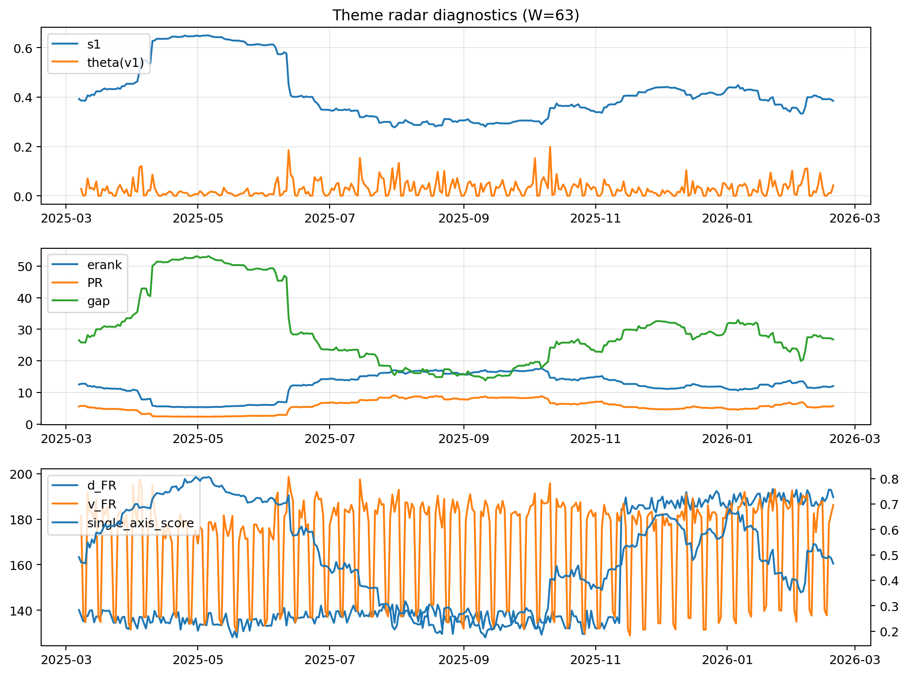

# Theme Radar Daily Brief — 2026-02-19

## Leaders (v1) — W=63
- **Nuclear_Uranium** (0.0865020730004307)
- Semis (0.0646066311493426)
- Quantum (0.0616229873383992)

## Challengers — W=63
**v2:** Metals (0.0819946303108276), Rates (0.0751796731556636), Nuclear_Uranium (0.0639805787666214)
**v3:** DataCenter_Infra (0.0876981884806012), Software_Cloud (0.0809093586950457), Grid_Power (0.0782484835430258)

## Migration (20D slope) — W=63
**Top risers:**
- axis_Crypto: 0.0008776645499137
- axis_Metals: 0.000733819444766
- axis_Genomics_Bio: 0.0005229814061269
- axis_Quantum: 0.0005144364070124
- axis_Critical_Minerals: 0.0004234066348643
- axis_Software_Cloud: 0.0003184169690168
- axis_Miners: 0.0002994430065141
- axis_Commodities: 0.0002203714682096
- axis_Drones_Autonomy: 0.0001985452332359
- axis_Sector_Energy: 0.0001180154044481

**Top fallers:**
- axis_Sector_ConsStap: -0.0001596188674639
- axis_Sector_Utilities: -0.0001597175971396
- axis_Nuclear_Uranium: -0.0002118790307696
- axis_MegaCap_AI: -0.0002955325048115
- axis_Grid_Power: -0.0003896111515228
- axis_Semis: -0.000422532712201
- axis_Credit: -0.0004242753418565
- axis_Space: -0.0005669015366438
- axis_Rates: -0.0007702794563562
- axis_DataCenter_Infra: -0.0008501922957877

## Risk line (W=63)
- s1: 0.3846365121795547
- theta_v1: 0.0428158876312193
- v_FR: 186.19560061029105
- single_axis_score: 0.4657142857142856

## Interpretation
**Regime:** `theme_migration`

- Action: Tomorrow watchlist: Crypto, Metals, Genomics_Bio, Quantum, Critical_Minerals + v2_top1=Metals
- Action: Hedge note: normal correlation stability.

- Percentiles (W=63 history): vfr_pct=0.80, theta_pct=0.77, s1_pct=0.46, score_pct=0.44.

---
**BUNDLE_ROOT_SHA256:** `64ade2f91a3508b22f50080fe63487e6821ec312110e42db6e43809f26090a10`
