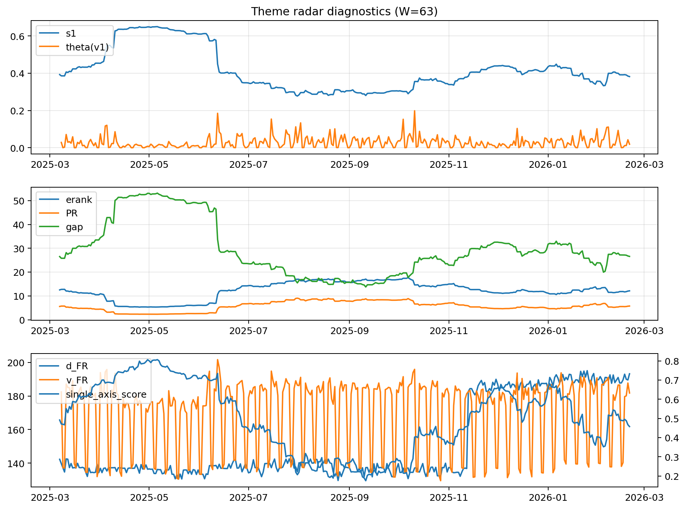

# Theme Radar Daily Brief — 2026-02-20

## Leaders (v1) — W=63
- **Nuclear_Uranium** (0.0863291969378744)
- Semis (0.0641294189937704)
- Quantum (0.0617579614640108)

## Challengers — W=63
**v2:** Metals (0.0807879794147002), Rates (0.0731658415674639), Nuclear_Uranium (0.0660139705859601)
**v3:** DataCenter_Infra (0.0863816277684986), Software_Cloud (0.0800176112582701), Rates (0.0798704761160604)

## Migration (20D slope) — W=63
**Top risers:**
- axis_Crypto: 0.0008528209926758
- axis_Metals: 0.0007674939337158
- axis_Quantum: 0.0005027905932922
- axis_Genomics_Bio: 0.0004844278774995
- axis_Critical_Minerals: 0.0004189796448202
- axis_Software_Cloud: 0.0003092391356498
- axis_Miners: 0.0003001060683629
- axis_Commodities: 0.0002533647854945
- axis_Drones_Autonomy: 0.0001829963836195
- axis_Sector_Energy: 0.0001347458344884

**Top fallers:**
- axis_Sector_ConsStap: -0.0001541498208306
- axis_Sector_Utilities: -0.0001668003624086
- axis_Nuclear_Uranium: -0.0002162317970287
- axis_MegaCap_AI: -0.0003150179797294
- axis_Grid_Power: -0.0004049764358985
- axis_Credit: -0.0004124648473123
- axis_Semis: -0.0004334736165051
- axis_Space: -0.0005828768800313
- axis_Rates: -0.0006702462671828
- axis_DataCenter_Infra: -0.0009478605382741

## Risk line (W=63)
- s1: 0.3819334503086034
- theta_v1: 0.0188334774406455
- v_FR: 181.7606922563761
- single_axis_score: 0.4575498575498575

## Interpretation
**Regime:** `theme_migration`

- Action: Tomorrow watchlist: Crypto, Metals, Quantum, Genomics_Bio, Critical_Minerals + v2_top1=Metals
- Action: Hedge note: normal correlation stability.

- Percentiles (W=63 history): vfr_pct=0.55, theta_pct=0.49, s1_pct=0.45, score_pct=0.43.

---
**BUNDLE_ROOT_SHA256:** `bb7ae8f7c48c11e355a51d1aee2d9db272efb8b84e36eba7ae1f9b14dac4cc12`
