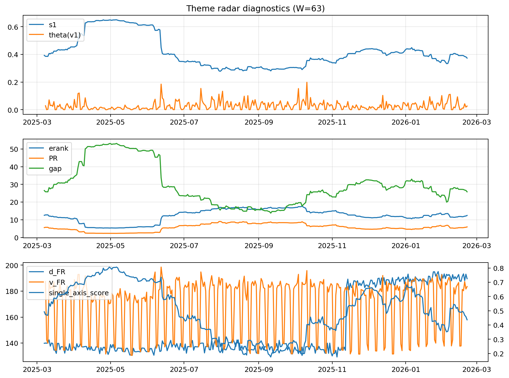

# Theme Radar Daily Brief — 2026-02-21

## Leaders (v1) — W=63
- **Nuclear_Uranium** (0.0863864610603093)
- Semis (0.0639794760492521)
- Quantum (0.0616848958123594)

## Challengers — W=63
**v2:** Metals (0.0817925068401157), Rates (0.0796568133520775), Nuclear_Uranium (0.0661615962775713)
**v3:** Software_Cloud (0.0882486536428237), DataCenter_Infra (0.0830113635950708), Genomics_Bio (0.0781986415929303)

## Migration (20D slope) — W=63
**Top risers:**
- axis_Metals: 0.0007878764557359
- axis_Crypto: 0.0007845482499227
- axis_Quantum: 0.0004768447272548
- axis_Genomics_Bio: 0.0004233650387138
- axis_Critical_Minerals: 0.0004147351692181
- axis_Miners: 0.0002959710056677
- axis_Software_Cloud: 0.0002837313175639
- axis_Commodities: 0.0002788056471253
- axis_Drones_Autonomy: 0.0001543922409008
- axis_Sector_Energy: 0.0001513383020082

**Top fallers:**
- axis_Sector_ConsStap: -0.0001514277710876
- axis_Sector_Utilities: -0.0001523429273388
- axis_Nuclear_Uranium: -0.0002140647452564
- axis_MegaCap_AI: -0.0003451042144343
- axis_Credit: -0.0003669476730268
- axis_Grid_Power: -0.0003950825489388
- axis_Semis: -0.0004339498037918
- axis_Rates: -0.0005619692966608
- axis_Space: -0.0005890579828774
- axis_DataCenter_Infra: -0.0010248219002969

## Risk line (W=63)
- s1: 0.3731380885592451
- theta_v1: 0.0262875157996374
- v_FR: 183.51647321110065
- single_axis_score: 0.4363636363636363

## Interpretation
**Regime:** `theme_migration`

- Action: Tomorrow watchlist: Metals, Crypto, Quantum, Genomics_Bio, Critical_Minerals + v2_top1=Metals
- Action: Hedge note: normal correlation stability.

- Percentiles (W=63 history): vfr_pct=0.66, theta_pct=0.57, s1_pct=0.43, score_pct=0.37.

---
**BUNDLE_ROOT_SHA256:** `9c095b05433ad88a1f75055194a264c4df1d02b237d3bec9f54817a1a0627ee1`
