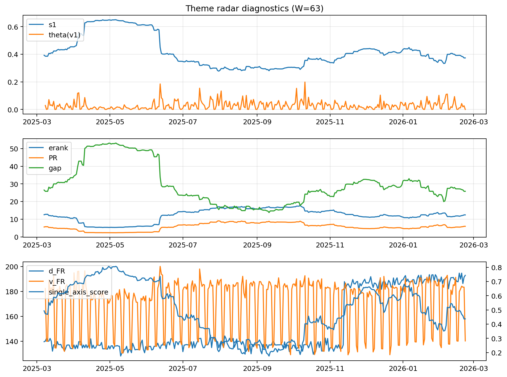

# Theme Radar Daily Brief — 2026-02-22

## Leaders (v1) — W=63
- **Nuclear_Uranium** (0.0863873436871895)
- Semis (0.0639780393600558)
- Quantum (0.0616849330053688)

## Challengers — W=63
**v2:** Metals (0.0818013073929516), Rates (0.0796710552178385), Nuclear_Uranium (0.066154637757683)
**v3:** Software_Cloud (0.0883104138501506), DataCenter_Infra (0.0830593327725117), Genomics_Bio (0.0783845445047155)

## Migration (20D slope) — W=63
**Top risers:**
- axis_Metals: 0.0007852213960942
- axis_Crypto: 0.0006908380077837
- axis_Quantum: 0.0004372855173701
- axis_Critical_Minerals: 0.0003954664695408
- axis_Genomics_Bio: 0.0003512565858872
- axis_Commodities: 0.0002963254194962
- axis_Miners: 0.0002821813251303
- axis_Software_Cloud: 0.0002525845243367
- axis_Sector_Energy: 0.000162560712513
- axis_Sector_Health: 0.0001389974659657

**Top fallers:**
- axis_Sector_Utilities: -0.0001340515188072
- axis_Sector_ConsStap: -0.000143985715545
- axis_Nuclear_Uranium: -0.0002077342124412
- axis_Credit: -0.000311949614173
- axis_MegaCap_AI: -0.0003636421530077
- axis_Grid_Power: -0.0003724841486606
- axis_Semis: -0.0004227900827968
- axis_Rates: -0.0004361193511802
- axis_Space: -0.0005823897651452
- axis_DataCenter_Infra: -0.0010787911905789

## Risk line (W=63)
- s1: 0.3731405203153088
- theta_v1: 6.735265519723393e-05
- v_FR: 140.312531302642
- single_axis_score: 0.4368271954674221

## Interpretation
**Regime:** `theme_migration`

- Action: Tomorrow watchlist: Metals, Crypto, Quantum, Critical_Minerals, Genomics_Bio + v2_top1=Metals
- Action: Hedge note: normal correlation stability.

- Percentiles (W=63 history): vfr_pct=0.27, theta_pct=0.03, s1_pct=0.44, score_pct=0.37.

---
**BUNDLE_ROOT_SHA256:** `a068faec3e48b786398bfea9f3dd952ada84f7d709e98a226c2670a2aaf821a5`
