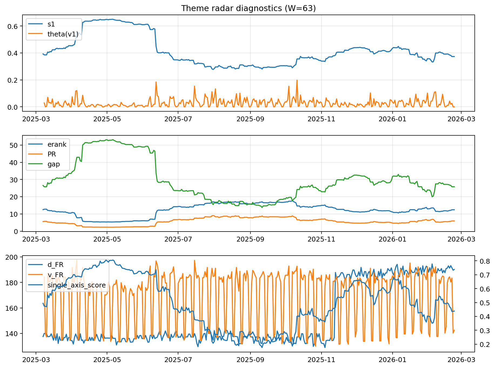

# Theme Radar Daily Brief — 2026-02-23

## Leaders (v1) — W=63
- **Nuclear_Uranium** (0.0863821085489297)
- Semis (0.0639768086631054)
- Quantum (0.0616794243084029)

## Challengers — W=63
**v2:** Metals (0.0818188312227986), Rates (0.0797276522879739), Nuclear_Uranium (0.0661650070344631)
**v3:** Software_Cloud (0.0883899979009879), DataCenter_Infra (0.083060326066096), Genomics_Bio (0.0784071886184539)

## Migration (20D slope) — W=63
**Top risers:**
- axis_Metals: 0.0007764131204667
- axis_Crypto: 0.0005494223711206
- axis_Quantum: 0.0003924629476589
- axis_Critical_Minerals: 0.0003760133940617
- axis_Commodities: 0.0002989140819005
- axis_Miners: 0.0002748762317292
- axis_Genomics_Bio: 0.0002405578950073
- axis_Software_Cloud: 0.0002335853116911
- axis_Sector_Energy: 0.0001751246751459
- axis_Sector_Health: 0.000127116101544

**Top fallers:**
- axis_Sector_ConsStap: -0.0001252591910223
- axis_Sector_Utilities: -0.0001312260962761
- axis_Nuclear_Uranium: -0.0001836495551729
- axis_Credit: -0.0002618326518016
- axis_Grid_Power: -0.0003442152848888
- axis_Rates: -0.0003448079859507
- axis_MegaCap_AI: -0.000350260240925
- axis_Semis: -0.0003651135847624
- axis_Space: -0.0005505441392356
- axis_DataCenter_Infra: -0.0011257569764208

## Risk line (W=63)
- s1: 0.3731710281827599
- theta_v1: 0.0002745012417921
- v_FR: 142.5190160053982
- single_axis_score: 0.4384180790960451

## Interpretation
**Regime:** `theme_migration`

- Action: Tomorrow watchlist: Metals, Crypto, Quantum, Critical_Minerals, Commodities + v2_top1=Metals
- Action: Hedge note: normal correlation stability.

- Percentiles (W=63 history): vfr_pct=0.28, theta_pct=0.11, s1_pct=0.44, score_pct=0.38.

---
**BUNDLE_ROOT_SHA256:** `d1a2962e78f50ddf38d59995248b28ec3a68e40ecacb4721f9c66036e13fbd5f`
