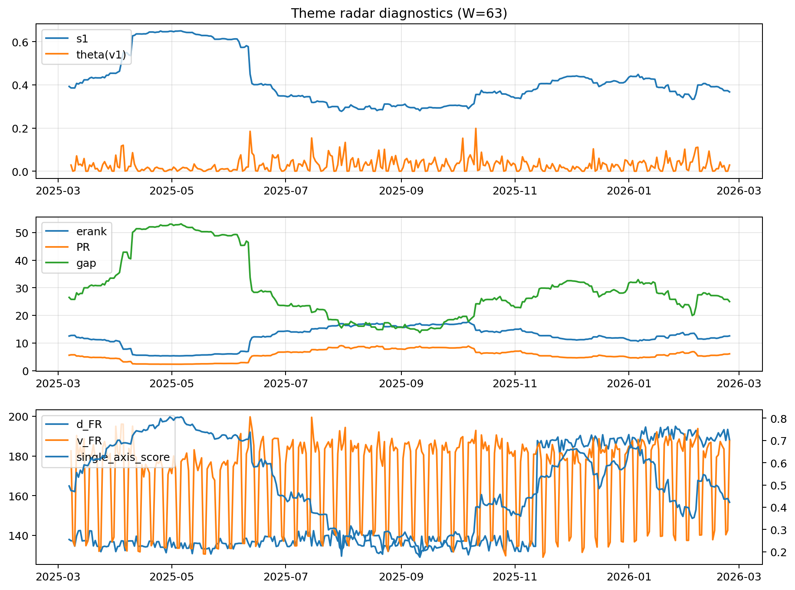

# Theme Radar Daily Brief — 2026-02-24

## Leaders (v1) — W=63
- **Nuclear_Uranium** (0.0889295780899929)
- Semis (0.064868126434619)
- Quantum (0.0618332722408827)

## Challengers — W=63
**v2:** Metals (0.086769688045798), Nuclear_Uranium (0.0661786373201633), Software_Cloud (0.0629631947627688)
**v3:** Rates (0.108179295994239), DataCenter_Infra (0.0953258726982211), Software_Cloud (0.0745656775521865)

## Migration (20D slope) — W=63
**Top risers:**
- axis_Metals: 0.0007327260052069
- axis_Crypto: 0.000394902001615
- axis_Quantum: 0.0003486735840698
- axis_Critical_Minerals: 0.000325643834689
- axis_Commodities: 0.0002929184587092
- axis_Miners: 0.0002466010632634
- axis_Sector_Energy: 0.0001903405909688
- axis_Sector_Materials: 0.0001446665639037
- axis_Software_Cloud: 0.0001408774956488
- axis_Genomics_Bio: 0.0001053565468471

**Top fallers:**
- axis_Nuclear_Uranium: -0.000102032307566
- axis_Sector_ConsStap: -0.0001092788948975
- axis_Sector_Utilities: -0.0001230367483125
- axis_Credit: -0.0001990289851642
- axis_Rates: -0.0002242989556485
- axis_Grid_Power: -0.0002630923438252
- axis_Semis: -0.0002895666074655
- axis_MegaCap_AI: -0.0003400605050264
- axis_Space: -0.0005003399031556
- axis_DataCenter_Infra: -0.001142527681216

## Risk line (W=63)
- s1: 0.3671843645644498
- theta_v1: 0.0287369499742902
- v_FR: 187.56619659584916
- single_axis_score: 0.4225352112676056

## Interpretation
**Regime:** `theme_migration`

- Action: Tomorrow watchlist: Metals, Crypto, Quantum, Critical_Minerals, Commodities + v2_top1=Metals
- Action: Hedge note: normal correlation stability.

- Percentiles (W=63 history): vfr_pct=0.87, theta_pct=0.61, s1_pct=0.40, score_pct=0.35.

---
**BUNDLE_ROOT_SHA256:** `4296905b0a72b387b1d15a67768756ea6a375ee713decda5b00f433b3d0a13aa`
