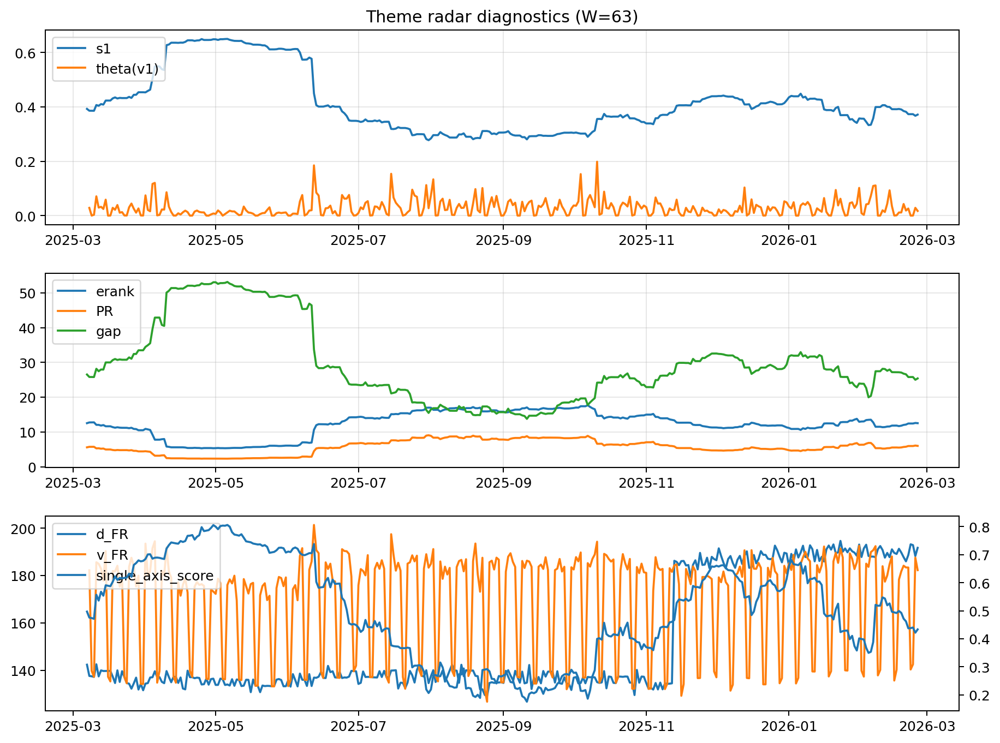

# Theme Radar Daily Brief — 2026-02-25

## Leaders (v1) — W=63
- **Nuclear_Uranium** (0.0887505943152191)
- Semis (0.0643617511738289)
- Quantum (0.0624589331038649)

## Challengers — W=63
**v2:** Metals (0.0884706645807368), Nuclear_Uranium (0.0658244395110542), Software_Cloud (0.060630776989367)
**v3:** Rates (0.1121334341662154), DataCenter_Infra (0.093728513885487), Software_Cloud (0.0730417599025158)

## Migration (20D slope) — W=63
**Top risers:**
- axis_Metals: 0.0006524306932151
- axis_Quantum: 0.000321114571474
- axis_Critical_Minerals: 0.0002913033814754
- axis_Commodities: 0.0002605814557112
- axis_Crypto: 0.0002207323140653
- axis_Miners: 0.0002061224116259
- axis_Sector_Energy: 0.0001647221120803
- axis_Sector_Materials: 0.0001171735939193
- axis_Sector_ConsDisc: 8.240214029985118e-05
- axis_Sector_Fin: 6.884702291350542e-05

**Top fallers:**
- axis_Cyber: -7.170719463538733e-05
- axis_Sector_ConsStap: -7.342390960649461e-05
- axis_Rates: -8.569127692443944e-05
- axis_Sector_Utilities: -0.0001036642354752
- axis_Credit: -0.000139592349851
- axis_Semis: -0.0001718128855831
- axis_Grid_Power: -0.0001927668541258
- axis_MegaCap_AI: -0.0002655446429504
- axis_Space: -0.0004259579817517
- axis_DataCenter_Infra: -0.0011593504034738

## Risk line (W=63)
- s1: 0.3715337828076224
- theta_v1: 0.0172643938506596
- v_FR: 182.27852511154867
- single_axis_score: 0.4337078651685394

## Interpretation
**Regime:** `theme_migration`

- Action: Tomorrow watchlist: Metals, Quantum, Critical_Minerals, Commodities, Crypto + v2_top1=Metals
- Action: Hedge note: normal correlation stability.

- Percentiles (W=63 history): vfr_pct=0.57, theta_pct=0.46, s1_pct=0.43, score_pct=0.37.

---
**BUNDLE_ROOT_SHA256:** `1c9687cd0a0d83ad68195bd4c9b00e6219e3e356d92a3df27f8e412fc7791b5b`
