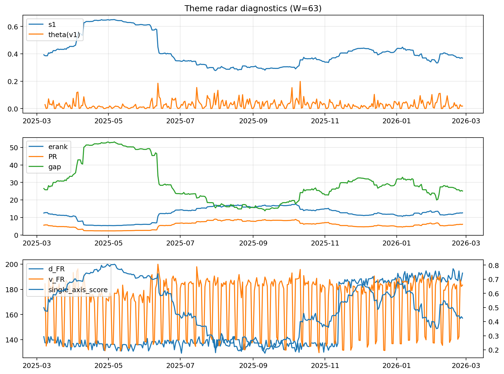

# Theme Radar Daily Brief — 2026-02-26

## Leaders (v1) — W=63
- **Nuclear_Uranium** (0.0884587712479174)
- Semis (0.0649344461497448)
- Quantum (0.0629626788459317)

## Challengers — W=63
**v2:** Metals (0.0843085449430985), Nuclear_Uranium (0.0692742359084223), Software_Cloud (0.0680337673201033)
**v3:** Rates (0.121916548173145), DataCenter_Infra (0.0925047033051485), MegaCap_AI (0.0705305284930449)

## Migration (20D slope) — W=63
**Top risers:**
- axis_Metals: 0.000643904006864
- axis_Quantum: 0.0003099243736757
- axis_Critical_Minerals: 0.0003041451779195
- axis_Commodities: 0.0002437190212243
- axis_Miners: 0.0001964565168659
- axis_Sector_Energy: 0.0001444494421223
- axis_Crypto: 0.0001441405443803
- axis_Sector_Materials: 0.0001083935137767
- axis_Sector_ConsDisc: 0.0001051307145022
- axis_Nuclear_Uranium: 0.0001048229648486

**Top fallers:**
- axis_Clean_Solar: -5.595152950538385e-05
- axis_Genomics_Bio: -8.18594688369339e-05
- axis_Sector_Utilities: -9.34176538153672e-05
- axis_Cyber: -0.0001036148033499
- axis_Credit: -0.0001277873420768
- axis_MegaCap_AI: -0.0001318234178335
- axis_Semis: -0.0001646368130098
- axis_Grid_Power: -0.0002164572281746
- axis_Space: -0.0003732532342528
- axis_DataCenter_Infra: -0.0011867724298042

## Risk line (W=63)
- s1: 0.3685471965840636
- theta_v1: 0.0180325790373131
- v_FR: 183.382717455875
- single_axis_score: 0.4246498599439776

## Interpretation
**Regime:** `theme_migration`

- Action: Tomorrow watchlist: Metals, Quantum, Critical_Minerals, Commodities, Miners + v2_top1=Metals
- Action: Hedge note: normal correlation stability.

- Percentiles (W=63 history): vfr_pct=0.62, theta_pct=0.47, s1_pct=0.40, score_pct=0.35.

---
**BUNDLE_ROOT_SHA256:** `41b5c6a71d5a21d8912c6121eff6597785c383e63ba41831030148dec150458c`
