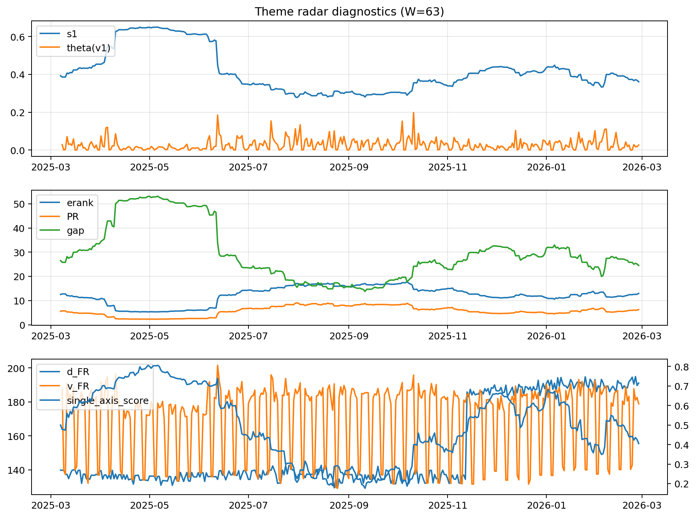

# Theme Radar Daily Brief — 2026-02-27

## Leaders (v1) — W=63
- **Nuclear_Uranium** (0.0892927228977829)
- Semis (0.0643050455399307)
- Quantum (0.0607349913900829)

## Challengers — W=63
**v2:** Metals (0.0861084726801342), Software_Cloud (0.0690810663818218), Nuclear_Uranium (0.0689937217802131)
**v3:** DataCenter_Infra (0.0969046871430386), Rates (0.0933106651330206), Software_Cloud (0.0726764576938943)

## Migration (20D slope) — W=63
**Top risers:**
- axis_Metals: 0.0006087644059269
- axis_Critical_Minerals: 0.0003046426647675
- axis_Quantum: 0.0002765929345228
- axis_Commodities: 0.0002225218560663
- axis_Miners: 0.0001805466381495
- axis_Crypto: 0.0001546618396949
- axis_Sector_Energy: 0.000141904402393
- axis_Nuclear_Uranium: 0.0001293279051271
- axis_Sector_ConsDisc: 0.0001101189983907
- axis_Sector_Materials: 0.0001028922775098

**Top fallers:**
- axis_Clean_Solar: -6.915010464479446e-05
- axis_Sector_Utilities: -7.770119046697462e-05
- axis_Credit: -0.0001108609939671
- axis_Cyber: -0.0001173878228823
- axis_MegaCap_AI: -0.0001351433423464
- axis_Genomics_Bio: -0.0001482198015644
- axis_Semis: -0.0001655780462238
- axis_Grid_Power: -0.0001957103698905
- axis_Space: -0.0003501672101823
- axis_DataCenter_Infra: -0.0010821576724865

## Risk line (W=63)
- s1: 0.3605324207190513
- theta_v1: 0.0262593552206217
- v_FR: 178.87037620092443
- single_axis_score: 0.4050279329608939

## Interpretation
**Regime:** `theme_migration`

- Action: Tomorrow watchlist: Metals, Critical_Minerals, Quantum, Commodities, Miners + v2_top1=Metals
- Action: Hedge note: normal correlation stability.

- Percentiles (W=63 history): vfr_pct=0.42, theta_pct=0.57, s1_pct=0.37, score_pct=0.32.

---
**BUNDLE_ROOT_SHA256:** `59b1a55f82cb02c89bffe779b5bea1d0504208a9c58dbfdb64512708a3094620`
