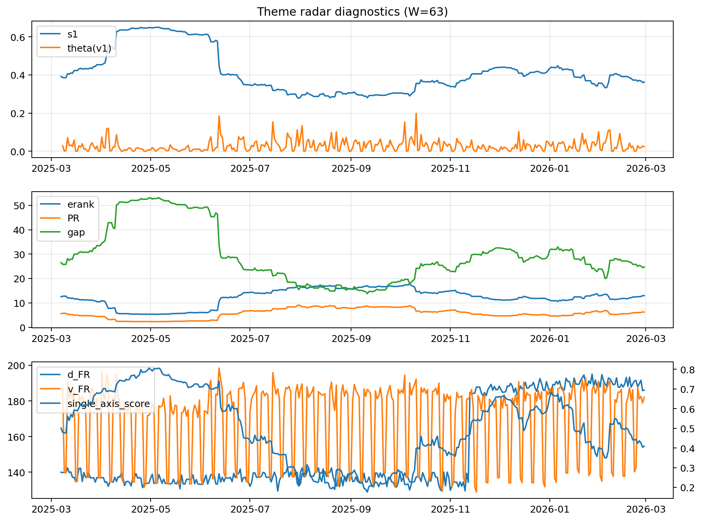

# Theme Radar Daily Brief — 2026-02-28

## Leaders (v1) — W=63
- **Nuclear_Uranium** (0.0894388560050595)
- Semis (0.0646745049271999)
- Quantum (0.0616536490996831)

## Challengers — W=63
**v2:** Metals (0.0926573394626879), Software_Cloud (0.0717466570410176), Nuclear_Uranium (0.0689815965230145)
**v3:** Rates (0.1089803870053001), DataCenter_Infra (0.1029674748545168), Software_Cloud (0.0631560811466366)

## Migration (20D slope) — W=63
**Top risers:**
- axis_Metals: 0.0005713428357445
- axis_Critical_Minerals: 0.0002940404155404
- axis_Quantum: 0.0002517422498739
- axis_Commodities: 0.0001803210688378
- axis_Crypto: 0.0001648897950071
- axis_Miners: 0.000159195784749
- axis_Nuclear_Uranium: 0.0001510940708517
- axis_Sector_Energy: 0.000129502418454
- axis_Sector_ConsDisc: 0.0001111560557763
- axis_Sector_Materials: 9.124059858809748e-05

**Top fallers:**
- axis_Drones_Autonomy: -6.912481829354337e-05
- axis_Clean_Solar: -7.845838922255897e-05
- axis_Credit: -9.093361177298372e-05
- axis_Cyber: -0.0001217718397175
- axis_MegaCap_AI: -0.000133764058957
- axis_Semis: -0.000157413941765
- axis_Grid_Power: -0.0001724639370138
- axis_Genomics_Bio: -0.0002014986373438
- axis_Space: -0.0003174018239231
- axis_DataCenter_Infra: -0.000968174915956

## Risk line (W=63)
- s1: 0.3623001878512987
- theta_v1: 0.0242548872021287
- v_FR: 182.0235541541404
- single_axis_score: 0.4089136490250696

## Interpretation
**Regime:** `theme_migration`

- Action: Tomorrow watchlist: Metals, Critical_Minerals, Quantum, Commodities, Crypto + v2_top1=Metals
- Action: Hedge note: normal correlation stability.

- Percentiles (W=63 history): vfr_pct=0.56, theta_pct=0.55, s1_pct=0.38, score_pct=0.33.

---
**BUNDLE_ROOT_SHA256:** `d43010f28710a045c7f78fdb07fb2614b71dc79cbfc735323a8a42c60d0703b4`
