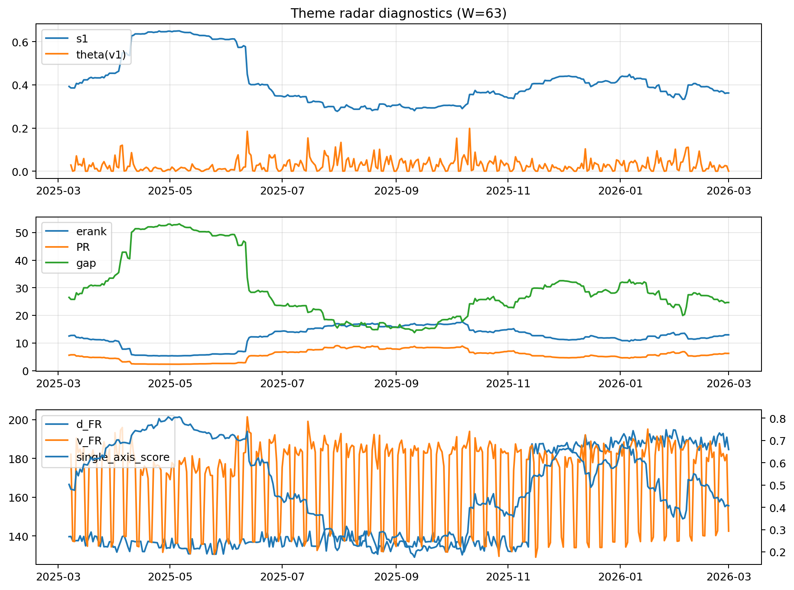

# Theme Radar Daily Brief — 2026-03-01

## Leaders (v1) — W=63
- **Nuclear_Uranium** (0.0894481564922783)
- Semis (0.0646792666030146)
- Quantum (0.0616586754267718)

## Challengers — W=63
**v2:** Metals (0.0926390786284175), Software_Cloud (0.0717935938936398), Nuclear_Uranium (0.068965461245872)
**v3:** Rates (0.1089407187335161), DataCenter_Infra (0.1029447738418416), Software_Cloud (0.063093739600884)

## Migration (20D slope) — W=63
**Top risers:**
- axis_Metals: 0.0005182619845427
- axis_Critical_Minerals: 0.000276558116675
- axis_Quantum: 0.0002208480329872
- axis_Crypto: 0.0001693889302492
- axis_Nuclear_Uranium: 0.0001677517777715
- axis_Commodities: 0.0001348828001494
- axis_Miners: 0.000133602218747
- axis_Sector_Energy: 0.0001149601896831
- axis_Sector_ConsDisc: 0.0001096119598992
- axis_Rates: 0.0001048773777555

**Top fallers:**
- axis_Sector_Health: -6.94290150047278e-05
- axis_Clean_Solar: -8.596881781520268e-05
- axis_Drones_Autonomy: -9.644097075079894e-05
- axis_Cyber: -0.0001246426448081
- axis_MegaCap_AI: -0.0001327329549424
- axis_Grid_Power: -0.0001451405632675
- axis_Semis: -0.0001460004321543
- axis_Genomics_Bio: -0.0002476964706232
- axis_Space: -0.0002748472188771
- axis_DataCenter_Infra: -0.0008253269751068

## Risk line (W=63)
- s1: 0.3622501045833868
- theta_v1: 0.0004333743337771
- v_FR: 142.5003205776831
- single_axis_score: 0.4072222222222222

## Interpretation
**Regime:** `theme_migration`

- Action: Tomorrow watchlist: Metals, Critical_Minerals, Quantum, Crypto, Nuclear_Uranium + v2_top1=Metals
- Action: Hedge note: normal correlation stability.

- Percentiles (W=63 history): vfr_pct=0.28, theta_pct=0.15, s1_pct=0.38, score_pct=0.32.

---
**BUNDLE_ROOT_SHA256:** `63d5e6b516907a9a0690596ec9b4de48b46f2c6f70c06c3dd813615d5a92f381`
