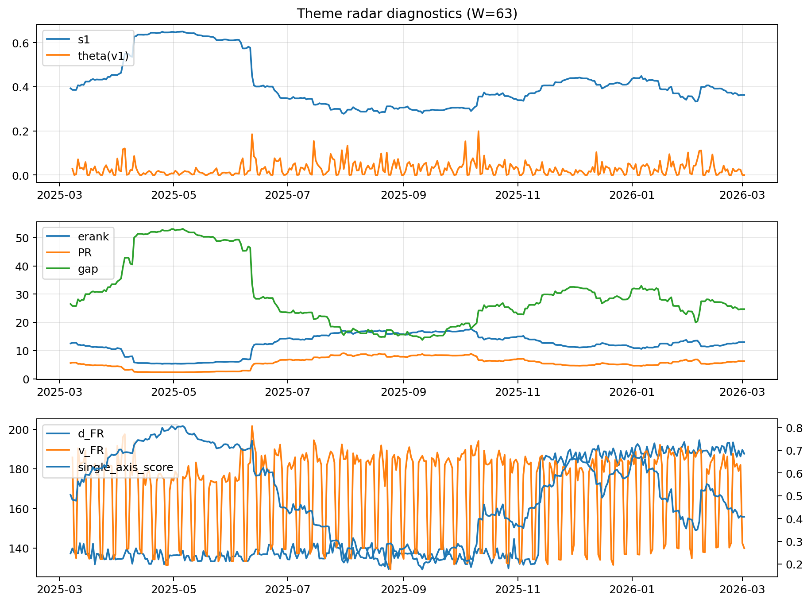

# Theme Radar Daily Brief — 2026-03-02

## Leaders (v1) — W=63
- **Nuclear_Uranium** (0.0894477758291635)
- Semis (0.0646808770349486)
- Quantum (0.0616547604998125)

## Challengers — W=63
**v2:** Metals (0.0926675279045817), Software_Cloud (0.0717059588176568), Nuclear_Uranium (0.0689755952884584)
**v3:** Rates (0.1090172222857132), DataCenter_Infra (0.1029843146878276), Software_Cloud (0.0632063394192853)

## Migration (20D slope) — W=63
**Top risers:**
- axis_Metals: 0.000453680266685
- axis_Critical_Minerals: 0.000254529239607
- axis_Nuclear_Uranium: 0.0001736404779631
- axis_Quantum: 0.0001735999437193
- axis_Crypto: 0.000160780917805
- axis_Rates: 0.0001525487030874
- axis_Miners: 0.0001098983448871
- axis_Sector_ConsDisc: 0.0001020865211961
- axis_Sector_Energy: 9.994924679065298e-05
- axis_Commodities: 9.4751789953153e-05

**Top fallers:**
- axis_Clean_Solar: -9.227520114889056e-05
- axis_Sector_Health: -9.567647928013278e-05
- axis_Cyber: -0.0001184139375943
- axis_Grid_Power: -0.0001217655399567
- axis_Drones_Autonomy: -0.0001218330255143
- axis_MegaCap_AI: -0.0001310128701417
- axis_Semis: -0.0001336203808202
- axis_Space: -0.0002236649863385
- axis_Genomics_Bio: -0.0002940686497448
- axis_DataCenter_Infra: -0.0006563089554608

## Risk line (W=63)
- s1: 0.3622557596961824
- theta_v1: 0.0001120686366806
- v_FR: 139.93976720151852
- single_axis_score: 0.4077562326869806

## Interpretation
**Regime:** `theme_migration`

- Action: Tomorrow watchlist: Metals, Critical_Minerals, Nuclear_Uranium, Quantum, Crypto + v2_top1=Metals
- Action: Hedge note: normal correlation stability.

- Percentiles (W=63 history): vfr_pct=0.25, theta_pct=0.06, s1_pct=0.38, score_pct=0.33.

---
**BUNDLE_ROOT_SHA256:** `bf1619078cdae3e74548972d7394cd6dac812652d931c518b5ef32916e5df69f`
