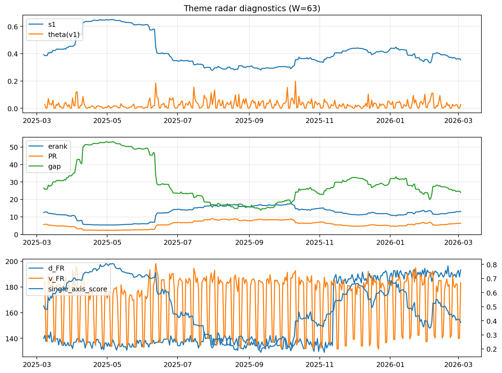

# Theme Radar Daily Brief — 2026-03-03

## Leaders (v1) — W=63
- **Nuclear_Uranium** (0.0899928267099477)
- Semis (0.0645578552863142)
- Quantum (0.062928249413535)

## Challengers — W=63
**v2:** Metals (0.0860785874847661), Nuclear_Uranium (0.0717662101295), Software_Cloud (0.0592325037967928)
**v3:** Rates (0.1060389554582533), DataCenter_Infra (0.095386047989297), Software_Cloud (0.0733872062505016)

## Migration (20D slope) — W=63
**Top risers:**
- axis_Metals: 0.0003931868581605
- axis_Critical_Minerals: 0.0002323012365868
- axis_Nuclear_Uranium: 0.0001855141728194
- axis_Rates: 0.0001781938340772
- axis_Crypto: 0.000167709142852
- axis_Quantum: 0.0001402389785946
- axis_Miners: 8.888771800161062e-05
- axis_Sector_Energy: 8.802393829077982e-05
- axis_Sector_ConsDisc: 8.281880302514164e-05
- axis_Equity_US: 7.611372172788924e-05

**Top fallers:**
- axis_Grid_Power: -9.359331665323592e-05
- axis_Clean_Solar: -9.531613408850466e-05
- axis_Cyber: -0.0001111943700799
- axis_Semis: -0.0001204800063556
- axis_Sector_Health: -0.0001210760804414
- axis_MegaCap_AI: -0.0001244328075322
- axis_Space: -0.0001540867840469
- axis_Drones_Autonomy: -0.0001705467069779
- axis_Genomics_Bio: -0.0003309570226676
- axis_DataCenter_Infra: -0.0004548816860839

## Risk line (W=63)
- s1: 0.3551024165644125
- theta_v1: 0.0280572118709722
- v_FR: 183.38274620777463
- single_axis_score: 0.3878453038674033

## Interpretation
**Regime:** `theme_migration`

- Action: Tomorrow watchlist: Metals, Critical_Minerals, Nuclear_Uranium, Rates, Crypto + v2_top1=Metals
- Action: Hedge note: normal correlation stability.

- Percentiles (W=63 history): vfr_pct=0.65, theta_pct=0.60, s1_pct=0.34, score_pct=0.28.

---
**BUNDLE_ROOT_SHA256:** `4749e03d23ed6af1ec243687ab3dc9e0b06d223c23ebf6b53f70d9cb79006f16`
