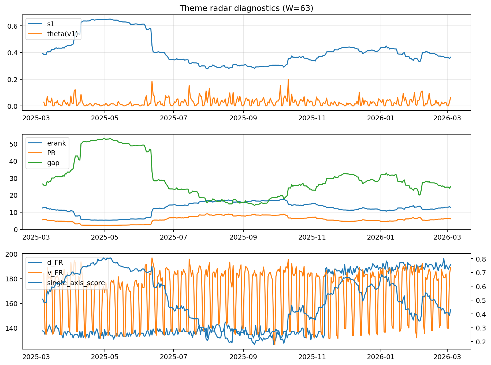

# Theme Radar Daily Brief — 2026-03-04

## Leaders (v1) — W=63
- **Nuclear_Uranium** (0.0904030808419272)
- Semis (0.066524044089974)
- Quantum (0.0615578260106472)

## Challengers — W=63
**v2:** Software_Cloud (0.0986137111158734), Metals (0.0773516430342756), Cyber (0.0663222827394621)
**v3:** Rates (0.1056354928359846), DataCenter_Infra (0.0780018845936078), Semis (0.0697710041369565)

## Migration (20D slope) — W=63
**Top risers:**
- axis_Metals: 0.0003681067721052
- axis_Critical_Minerals: 0.000223993792547
- axis_Nuclear_Uranium: 0.0002148450437518
- axis_Rates: 0.0001939169128857
- axis_Crypto: 0.0001387166198363
- axis_Quantum: 0.0001025711864355
- axis_Miners: 8.745706076550236e-05
- axis_Sector_Energy: 8.126757481734396e-05
- axis_Equity_US: 7.132871440078653e-05
- axis_Sector_ConsDisc: 6.024721158386019e-05

**Top fallers:**
- axis_Sector_ConsStap: -4.93928615035261e-05
- axis_Semis: -8.521789141775887e-05
- axis_Clean_Solar: -8.852450215196825e-05
- axis_Space: -0.0001007470739496
- axis_Sector_Health: -0.0001300596997042
- axis_MegaCap_AI: -0.0001433756768795
- axis_Cyber: -0.0001518577111529
- axis_Drones_Autonomy: -0.0002335947540914
- axis_DataCenter_Infra: -0.0002480486568837
- axis_Genomics_Bio: -0.0003207488857508

## Risk line (W=63)
- s1: 0.3643429106498195
- theta_v1: 0.062327572917672
- v_FR: 189.19652834399517
- single_axis_score: 0.4297520661157025

## Interpretation
**Regime:** `structure_rewrite`

- Action: Tomorrow watchlist: Metals, Critical_Minerals, Nuclear_Uranium, Rates, Crypto + v2_top1=Software_Cloud
- Action: Hedge note: v_FR high + theta high → correlation structure unstable; diversify hedges / reduce reliance on static correlations.

- Percentiles (W=63 history): vfr_pct=0.91, theta_pct=0.89, s1_pct=0.40, score_pct=0.37.

---
**BUNDLE_ROOT_SHA256:** `2dab49aa48d108837cc45550d924d00df26863f34c934efec039e959cdf581e0`
