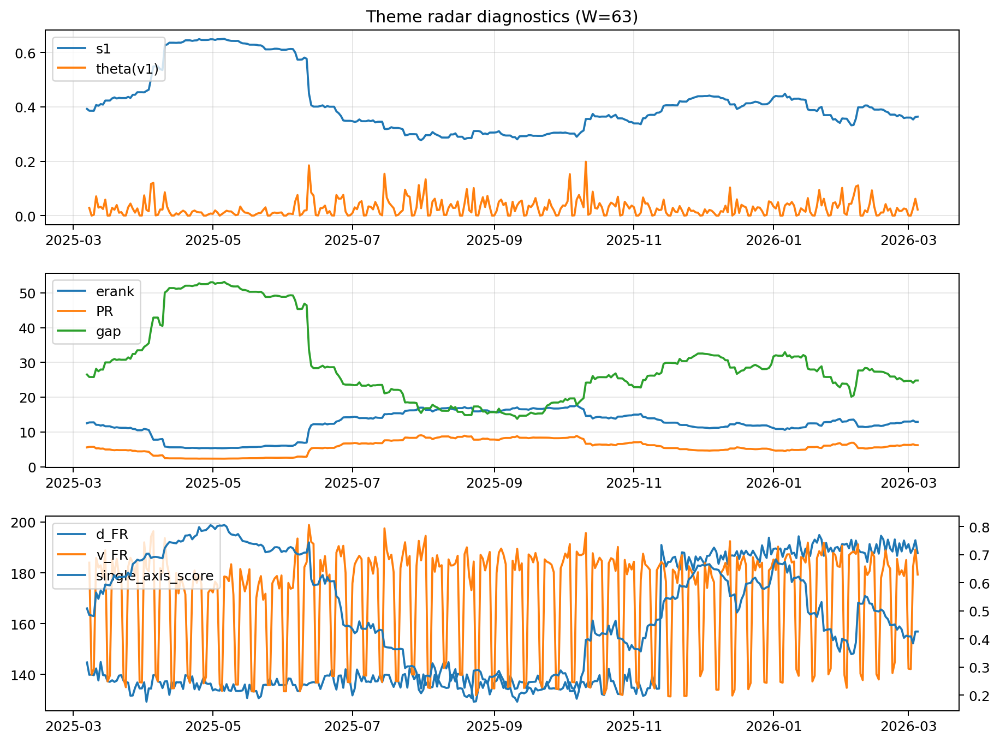

# Theme Radar Daily Brief — 2026-03-05

## Leaders (v1) — W=63
- **Nuclear_Uranium** (0.0905429997610479)
- Semis (0.0670523901449808)
- Quantum (0.0618622857492976)

## Challengers — W=63
**v2:** Software_Cloud (0.0969083097158735), Metals (0.0730478452923309), Crypto (0.0660162764428392)
**v3:** Rates (0.0974307043601326), DataCenter_Infra (0.0817600930252438), Semis (0.073960553550281)

## Migration (20D slope) — W=63
**Top risers:**
- axis_Metals: 0.0003553230536198
- axis_Nuclear_Uranium: 0.0002485205317378
- axis_Critical_Minerals: 0.0002257338817301
- axis_Rates: 0.0002108654935633
- axis_Crypto: 0.0001140137741704
- axis_Miners: 9.31876953509326e-05
- axis_Sector_Energy: 7.592050022315984e-05
- axis_Quantum: 7.55872321531953e-05
- axis_Equity_US: 7.071353544061602e-05
- axis_Credit: 5.9247095847739376e-05

**Top fallers:**
- axis_Commodities: -5.64228788339035e-05
- axis_Defense: -6.581568917723547e-05
- axis_Clean_Solar: -7.746648288520587e-05
- axis_MegaCap_AI: -9.749441033150674e-05
- axis_Space: -0.0001111490602083
- axis_Sector_Health: -0.0001413773867395
- axis_Cyber: -0.0001742394748516
- axis_DataCenter_Infra: -0.0001918033569422
- axis_Drones_Autonomy: -0.0002927552199227
- axis_Genomics_Bio: -0.0003035443580775

## Risk line (W=63)
- s1: 0.3639551988231612
- theta_v1: 0.0222098054903244
- v_FR: 179.3295679385107
- single_axis_score: 0.4263736263736263

## Interpretation
**Regime:** `theme_migration`

- Action: Tomorrow watchlist: Metals, Nuclear_Uranium, Critical_Minerals, Rates, Crypto + v2_top1=Software_Cloud
- Action: Hedge note: normal correlation stability.

- Percentiles (W=63 history): vfr_pct=0.44, theta_pct=0.54, s1_pct=0.39, score_pct=0.36.

---
**BUNDLE_ROOT_SHA256:** `b2896755f7e9a0263b5e81e425962092d05932fc9e99fbe4caa33f0f3acf576f`
