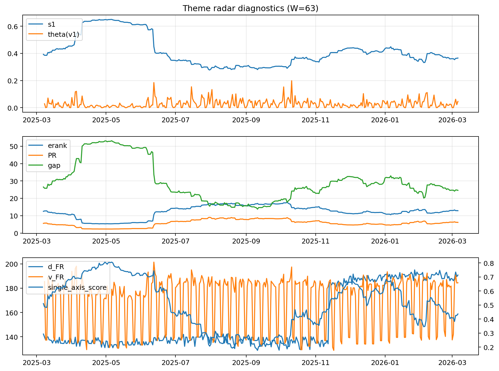

# Theme Radar Daily Brief — 2026-03-06

## Leaders (v1) — W=63
- **Nuclear_Uranium** (0.0915137660511581)
- Semis (0.0653737661404463)
- Quantum (0.0615273062700622)

## Challengers — W=63
**v2:** Software_Cloud (0.0993464407595775), Cyber (0.0666130578535791), Crypto (0.0636514746792259)
**v3:** Rates (0.09367896958567), Metals (0.0780581228757477), DataCenter_Infra (0.0710696348324056)

## Migration (20D slope) — W=63
**Top risers:**
- axis_Metals: 0.0003603852553872
- axis_Nuclear_Uranium: 0.0002708134778936
- axis_Critical_Minerals: 0.0002328213441478
- axis_Rates: 0.0001768834343988
- axis_Miners: 0.0001071193296196
- axis_Crypto: 9.523885605018264e-05
- axis_Credit: 7.873990120440165e-05
- axis_Equity_US: 6.879703008757512e-05
- axis_Sector_Energy: 6.044884253534777e-05
- axis_Quantum: 5.443004416838564e-05

**Top fallers:**
- axis_Clean_Solar: -6.361812188210546e-05
- axis_MegaCap_AI: -9.271101292382164e-05
- axis_Space: -9.732543230623234e-05
- axis_Sector_Health: -0.0001238179164053
- axis_Software_Cloud: -0.0001271497589787
- axis_Commodities: -0.000130848158484
- axis_DataCenter_Infra: -0.0001372942709393
- axis_Cyber: -0.0002228266074542
- axis_Genomics_Bio: -0.0002479162040991
- axis_Drones_Autonomy: -0.0003337097142972

## Risk line (W=63)
- s1: 0.3654564483573493
- theta_v1: 0.0461637575251193
- v_FR: 184.46936095040587
- single_axis_score: 0.4361643835616438

## Interpretation
**Regime:** `theme_migration`

- Action: Tomorrow watchlist: Metals, Nuclear_Uranium, Critical_Minerals, Rates, Miners + v2_top1=Software_Cloud
- Action: Hedge note: normal correlation stability.

- Percentiles (W=63 history): vfr_pct=0.72, theta_pct=0.80, s1_pct=0.41, score_pct=0.40.

---
**BUNDLE_ROOT_SHA256:** `cf9565b0253541d8f13bbdd90f55f6c215ca8a4af35364b5baa86e1ae8f12d44`
