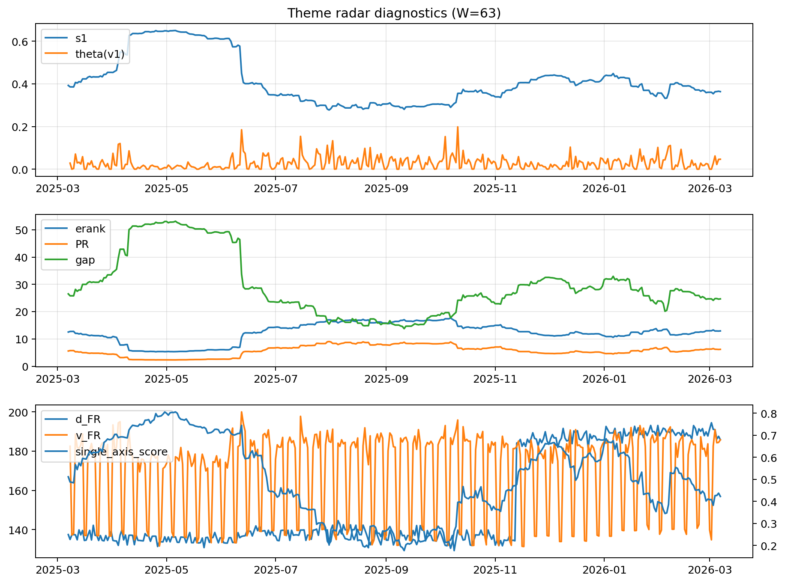

# Theme Radar Daily Brief — 2026-03-07

## Leaders (v1) — W=63
- **Nuclear_Uranium** (0.089660051635808)
- Semis (0.0648860188052276)
- Quantum (0.0600672597898246)

## Challengers — W=63
**v2:** Software_Cloud (0.0940549323327984), Rates (0.0669526012609695), Cyber (0.0640230154104836)
**v3:** Metals (0.0802754885078019), Semis (0.0791695344690782), Nuclear_Uranium (0.0644866842219725)

## Migration (20D slope) — W=63
**Top risers:**
- axis_Metals: 0.0003295704458837
- axis_Nuclear_Uranium: 0.000259875688111
- axis_Critical_Minerals: 0.000223546201539
- axis_Rates: 0.00013933689303
- axis_Miners: 0.0001179205858006
- axis_Credit: 0.0001100461644918
- axis_Equity_US: 8.088911862558223e-05
- axis_Crypto: 7.742284833461759e-05
- axis_Grid_Power: 6.951364918956808e-05
- axis_Sector_Materials: 4.15263415322401e-05

**Top fallers:**
- axis_Clean_Solar: -5.60352745456945e-05
- axis_DataCenter_Infra: -6.78348230153844e-05
- axis_Defense: -6.962386013399792e-05
- axis_Sector_Health: -0.0001042953141921
- axis_Space: -0.0001062950011337
- axis_Software_Cloud: -0.0001664403975807
- axis_Genomics_Bio: -0.000193382078599
- axis_Commodities: -0.0001946169382529
- axis_Cyber: -0.0002428947831239
- axis_Drones_Autonomy: -0.0003858957270204

## Risk line (W=63)
- s1: 0.3636109877048301
- theta_v1: 0.0467035569999525
- v_FR: 185.8044645057812
- single_axis_score: 0.4224043715846994

## Interpretation
**Regime:** `theme_migration`

- Action: Tomorrow watchlist: Metals, Nuclear_Uranium, Critical_Minerals, Rates, Miners + v2_top1=Software_Cloud
- Action: Hedge note: normal correlation stability.

- Percentiles (W=63 history): vfr_pct=0.79, theta_pct=0.81, s1_pct=0.39, score_pct=0.36.

---
**BUNDLE_ROOT_SHA256:** `0b20196138c7da6275563f79dd365dbb1482fbfc6496eb64bbc31b961f390ff2`
