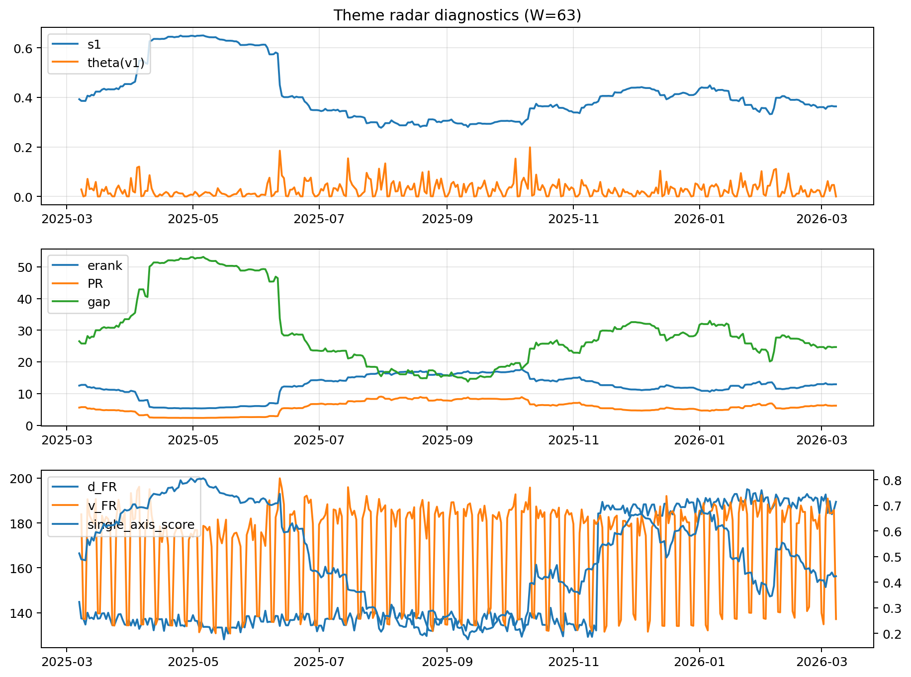

# Theme Radar Daily Brief — 2026-03-08

## Leaders (v1) — W=63
- **Nuclear_Uranium** (0.0896579314611871)
- Semis (0.0648850152388863)
- Quantum (0.0600645501693695)

## Challengers — W=63
**v2:** Software_Cloud (0.0940658089634591), Rates (0.0669786414517731), Cyber (0.0640316168512925)
**v3:** Metals (0.0802920972344661), Semis (0.0791707074407271), Nuclear_Uranium (0.0644910562706039)

## Migration (20D slope) — W=63
**Top risers:**
- axis_Metals: 0.0002887123700541
- axis_Nuclear_Uranium: 0.0002450453833297
- axis_Critical_Minerals: 0.0002068051360177
- axis_Credit: 0.0001360558446998
- axis_Miners: 0.0001238425148574
- axis_Rates: 0.0001007860779507
- axis_Grid_Power: 9.857710030155364e-05
- axis_Equity_US: 9.030468724460216e-05
- axis_Crypto: 5.689913820923203e-05
- axis_Sector_ConsDisc: 4.484728711696888e-05

**Top fallers:**
- axis_Sector_ConsStap: -4.52220949699296e-05
- axis_Clean_Solar: -4.659040845463164e-05
- axis_Defense: -7.988252037575048e-05
- axis_Sector_Health: -8.492477547291813e-05
- axis_Space: -0.0001108235208503
- axis_Genomics_Bio: -0.0001377678758676
- axis_Software_Cloud: -0.0002000580825462
- axis_Commodities: -0.0002532841235319
- axis_Cyber: -0.000254491705593
- axis_Drones_Autonomy: -0.0004256390258754

## Risk line (W=63)
- s1: 0.3636205461924646
- theta_v1: 9.768149098464666e-05
- v_FR: 137.13105716420566
- single_axis_score: 0.4234332425068119

## Interpretation
**Regime:** `theme_migration`

- Action: Tomorrow watchlist: Metals, Nuclear_Uranium, Critical_Minerals, Credit, Miners + v2_top1=Software_Cloud
- Action: Hedge note: normal correlation stability.

- Percentiles (W=63 history): vfr_pct=0.19, theta_pct=0.05, s1_pct=0.39, score_pct=0.36.

---
**BUNDLE_ROOT_SHA256:** `81c0c693521ec9f4e91938ef9bd44a692fb3435d0d45c7c76600213ed90a9b8b`
