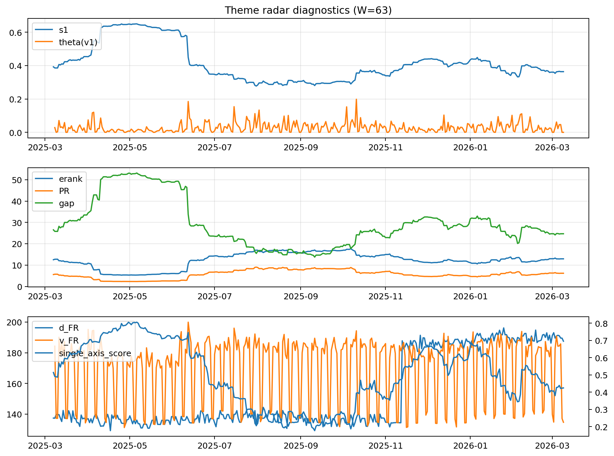

# Theme Radar Daily Brief — 2026-03-09

## Leaders (v1) — W=63
- **Nuclear_Uranium** (0.0896558061605461)
- Semis (0.0648845220926962)
- Quantum (0.0600599302492208)

## Challengers — W=63
**v2:** Software_Cloud (0.0940858123912262), Rates (0.0670355338293823), Cyber (0.0640472936422649)
**v3:** Metals (0.0803288273925497), Semis (0.0791733338540306), Nuclear_Uranium (0.0645003429604316)

## Migration (20D slope) — W=63
**Top risers:**
- axis_Metals: 0.0002495611342657
- axis_Nuclear_Uranium: 0.0002203856668177
- axis_Critical_Minerals: 0.000182381629901
- axis_Credit: 0.0001609458312705
- axis_Grid_Power: 0.0001325243513176
- axis_Miners: 0.0001241886484964
- axis_Equity_US: 9.571533808219076e-05
- axis_DataCenter_Infra: 7.574996917823174e-05
- axis_MegaCap_AI: 6.226434929728715e-05
- axis_Rates: 5.434668367232319e-05

**Top fallers:**
- axis_Sector_ConsStap: -4.285984597948033e-05
- axis_Sector_Health: -5.596718246009524e-05
- axis_Quantum: -7.429728001718123e-05
- axis_Genomics_Bio: -8.113359836692292e-05
- axis_Defense: -8.698052614171716e-05
- axis_Space: -0.000115688793652
- axis_Software_Cloud: -0.0002347396545471
- axis_Cyber: -0.0002617156446163
- axis_Commodities: -0.0003115128623134
- axis_Drones_Autonomy: -0.0004542220465665

## Risk line (W=63)
- s1: 0.3636278702162733
- theta_v1: 0.0001003733391851
- v_FR: 134.68768243498062
- single_axis_score: 0.4244565217391304

## Interpretation
**Regime:** `theme_migration`

- Action: Tomorrow watchlist: Metals, Nuclear_Uranium, Critical_Minerals, Credit, Grid_Power + v2_top1=Software_Cloud
- Action: Hedge note: normal correlation stability.

- Percentiles (W=63 history): vfr_pct=0.10, theta_pct=0.06, s1_pct=0.39, score_pct=0.36.

---
**BUNDLE_ROOT_SHA256:** `b96ef149b756772a38d70444cfc38c00a019e2abc114667b2ef64ce55992f0da`
