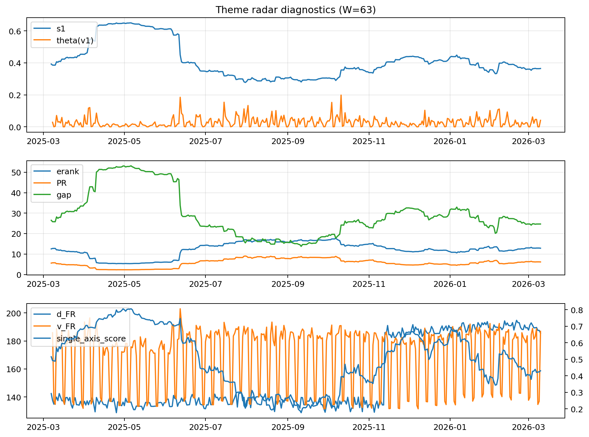

# Theme Radar Daily Brief — 2026-03-10

## Leaders (v1) — W=63
- **Nuclear_Uranium** (0.0895135183502377)
- Semis (0.0666210906328986)
- Quantum (0.0591658486198733)

## Challengers — W=63
**v2:** Software_Cloud (0.0934994682450628), Rates (0.0731232225574295), Cyber (0.063271633146332)
**v3:** Metals (0.0851048902105649), Semis (0.0790406364415216), Nuclear_Uranium (0.0630953908194817)

## Migration (20D slope) — W=63
**Top risers:**
- axis_Grid_Power: 0.0001956694124217
- axis_Nuclear_Uranium: 0.0001929950980116
- axis_Credit: 0.0001907381137935
- axis_Metals: 0.0001852359313128
- axis_DataCenter_Infra: 0.0001688292891978
- axis_Critical_Minerals: 0.000143115042241
- axis_MegaCap_AI: 0.0001315122052336
- axis_Miners: 0.0001079222293355
- axis_Equity_US: 0.0001000792865875
- axis_Semis: 8.481579909651873e-05

**Top fallers:**
- axis_Sector_ConsStap: -3.291472223185206e-05
- axis_Equity_ExUS: -3.751627614064038e-05
- axis_Sector_Energy: -8.42211815604264e-05
- axis_Defense: -0.0001060427131921
- axis_Quantum: -0.0001111880821219
- axis_Space: -0.0001252128133718
- axis_Cyber: -0.0002695289133874
- axis_Software_Cloud: -0.0002720574804009
- axis_Commodities: -0.0003719874659274
- axis_Drones_Autonomy: -0.0004945288255104

## Risk line (W=63)
- s1: 0.3646598888065892
- theta_v1: 0.0407566602964315
- v_FR: 186.8962974437173
- single_axis_score: 0.4303523035230352

## Interpretation
**Regime:** `theme_migration`

- Action: Tomorrow watchlist: Grid_Power, Nuclear_Uranium, Credit, Metals, DataCenter_Infra + v2_top1=Software_Cloud
- Action: Hedge note: normal correlation stability.

- Percentiles (W=63 history): vfr_pct=0.84, theta_pct=0.76, s1_pct=0.40, score_pct=0.38.

---
**BUNDLE_ROOT_SHA256:** `164fb0aeceeb697ee4af2bc863a4046b35989c5467d3003c6dccb3cfdcf53bd3`
