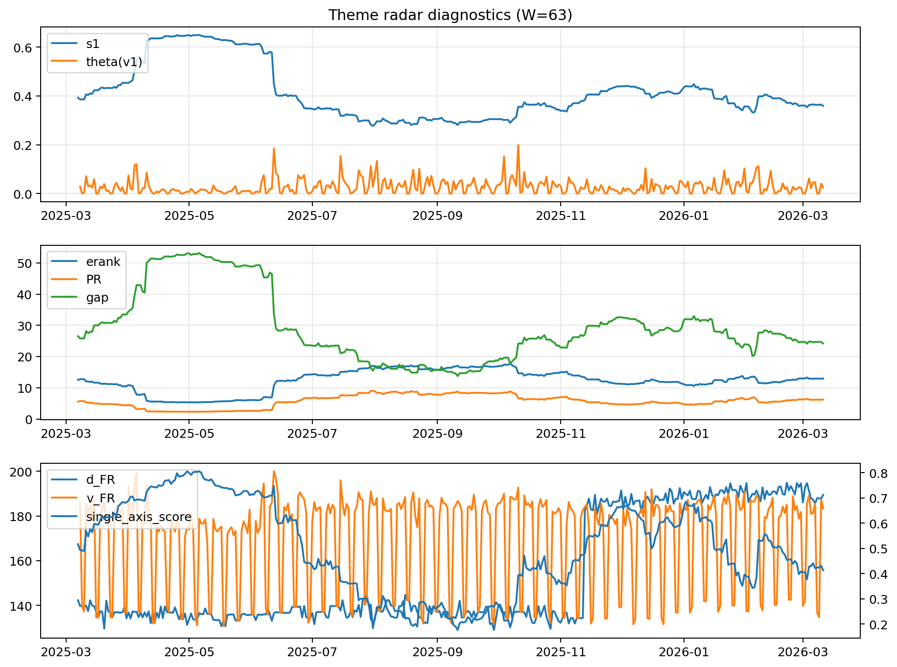

# Theme Radar Daily Brief — 2026-03-11

## Leaders (v1) — W=63
- **Nuclear_Uranium** (0.0896985029758209)
- Semis (0.066890854145542)
- Quantum (0.0593698669533842)

## Challengers — W=63
**v2:** Software_Cloud (0.0953978834407224), Cyber (0.0648174410493), Crypto (0.0634671700543395)
**v3:** Metals (0.0811640748862024), Semis (0.0792915433089639), Nuclear_Uranium (0.0637565828921553)

## Migration (20D slope) — W=63
**Top risers:**
- axis_Grid_Power: 0.0002190305476374
- axis_Credit: 0.0002046432961221
- axis_DataCenter_Infra: 0.000203762033816
- axis_MegaCap_AI: 0.000185400986969
- axis_Nuclear_Uranium: 0.0001653038777981
- axis_Metals: 0.0001589393339785
- axis_Critical_Minerals: 0.0001383030588984
- axis_Miners: 0.0001098966623779
- axis_Semis: 0.0001080201482458
- axis_Equity_US: 0.0001036356408191

**Top fallers:**
- axis_Equity_ExUS: -3.456226386919284e-05
- axis_Sector_Fin: -4.433975109528595e-05
- axis_Sector_Energy: -9.569813416943638e-05
- axis_Defense: -0.0001264311567034
- axis_Space: -0.000139140271974
- axis_Quantum: -0.0001393191166799
- axis_Cyber: -0.0002803975210565
- axis_Software_Cloud: -0.0003064958522382
- axis_Commodities: -0.0003941253163034
- axis_Drones_Autonomy: -0.0005246517608117

## Risk line (W=63)
- s1: 0.3594586792419071
- theta_v1: 0.0247667777486621
- v_FR: 183.31896763757516
- single_axis_score: 0.4129729729729729

## Interpretation
**Regime:** `theme_migration`

- Action: Tomorrow watchlist: Grid_Power, Credit, DataCenter_Infra, MegaCap_AI, Nuclear_Uranium + v2_top1=Software_Cloud
- Action: Hedge note: normal correlation stability.

- Percentiles (W=63 history): vfr_pct=0.63, theta_pct=0.56, s1_pct=0.37, score_pct=0.33.

---
**BUNDLE_ROOT_SHA256:** `16988060fea716778400c8ca3508154b86ca8efc8eb33d8d1527fd48152a062b`
