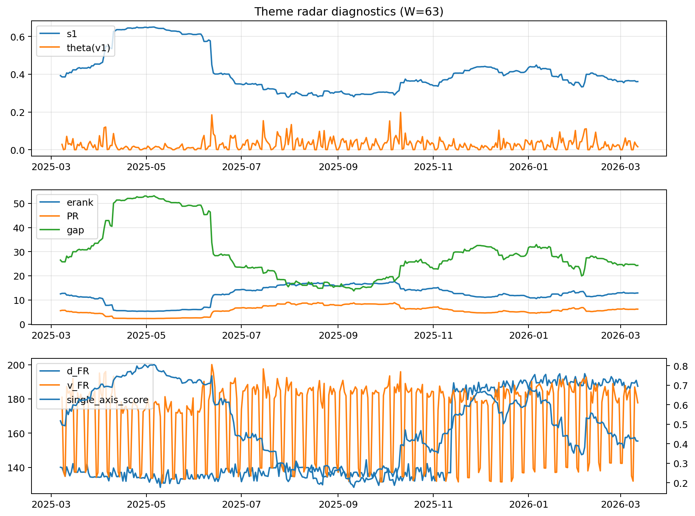

# Theme Radar Daily Brief — 2026-03-12

## Leaders (v1) — W=63
- **Nuclear_Uranium** (0.089440608743852)
- Semis (0.0665075410474112)
- Quantum (0.0591283641325448)

## Challengers — W=63
**v2:** Rates (0.0933428807876194), Software_Cloud (0.0847149753457875), DataCenter_Infra (0.0611594690085803)
**v3:** Metals (0.0933981679490697), Semis (0.0660118945697348), Nuclear_Uranium (0.0649352966741371)

## Migration (20D slope) — W=63
**Top risers:**
- axis_DataCenter_Infra: 0.000243998191689
- axis_MegaCap_AI: 0.0002273880719001
- axis_Grid_Power: 0.0002250044085541
- axis_Credit: 0.0001599930690412
- axis_Nuclear_Uranium: 0.0001446520668
- axis_Metals: 0.0001369994754691
- axis_Critical_Minerals: 0.0001361806593244
- axis_Genomics_Bio: 0.0001322090161959
- axis_Semis: 0.0001219265433579
- axis_Miners: 0.0001144889691912

**Top fallers:**
- axis_Sector_Fin: -5.71084580843326e-05
- axis_Rates: -9.935979829956864e-05
- axis_Sector_Energy: -0.000101203755097
- axis_Defense: -0.000144048885586
- axis_Space: -0.0001464368360288
- axis_Quantum: -0.000155680546381
- axis_Cyber: -0.0002721397265437
- axis_Software_Cloud: -0.0003240116959153
- axis_Commodities: -0.0003889353411143
- axis_Drones_Autonomy: -0.0005412198161649

## Risk line (W=63)
- s1: 0.3610761696273599
- theta_v1: 0.0158362460080663
- v_FR: 177.71627578025218
- single_axis_score: 0.4140161725067385

## Interpretation
**Regime:** `theme_migration`

- Action: Tomorrow watchlist: DataCenter_Infra, MegaCap_AI, Grid_Power, Credit, Nuclear_Uranium + v2_top1=Rates
- Action: Hedge note: normal correlation stability.

- Percentiles (W=63 history): vfr_pct=0.40, theta_pct=0.44, s1_pct=0.37, score_pct=0.33.

---
**BUNDLE_ROOT_SHA256:** `6e86c8db679bdb618009dde0ee24295fec5264333662ad514663ed1836966a9a`
