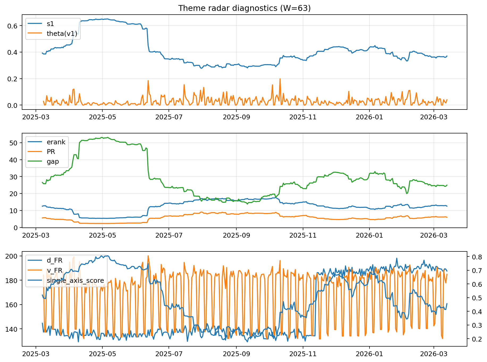

# Theme Radar Daily Brief — 2026-03-13

## Leaders (v1) — W=63
- **Nuclear_Uranium** (0.0868478138225972)
- Semis (0.0671167901656655)
- Quantum (0.0585919918452267)

## Challengers — W=63
**v2:** Rates (0.1038924276905499), Software_Cloud (0.0689463051734977), DataCenter_Infra (0.0616284120051021)
**v3:** Metals (0.0983073544555011), Software_Cloud (0.0631435969847942), MegaCap_AI (0.062945453765801)

## Migration (20D slope) — W=63
**Top risers:**
- axis_DataCenter_Infra: 0.0002728214052462
- axis_MegaCap_AI: 0.0002597918193788
- axis_Grid_Power: 0.0002437779163545
- axis_Genomics_Bio: 0.000208299988956
- axis_Credit: 0.0001848443518177
- axis_Critical_Minerals: 0.0001388218167465
- axis_Semis: 0.000132956104986
- axis_Miners: 0.0001168977470703
- axis_Metals: 0.0001093885527677
- axis_Equity_US: 0.0001055975404581

**Top fallers:**
- axis_Sector_Fin: -6.257940646449182e-05
- axis_Sector_Energy: -0.0001016255786973
- axis_Defense: -0.0001486730269821
- axis_Space: -0.000157269094242
- axis_Rates: -0.0001661649886131
- axis_Quantum: -0.0001829104188842
- axis_Cyber: -0.0002848532716003
- axis_Software_Cloud: -0.0003511040654727
- axis_Commodities: -0.0003796050986704
- axis_Drones_Autonomy: -0.0005553174169723

## Risk line (W=63)
- s1: 0.3700235706833321
- theta_v1: 0.0400798957372507
- v_FR: 184.83970082258327
- single_axis_score: 0.4559139784946236

## Interpretation
**Regime:** `theme_migration`

- Action: Tomorrow watchlist: DataCenter_Infra, MegaCap_AI, Grid_Power, Genomics_Bio, Credit + v2_top1=Rates
- Action: Hedge note: normal correlation stability.

- Percentiles (W=63 history): vfr_pct=0.73, theta_pct=0.76, s1_pct=0.44, score_pct=0.45.

---
**BUNDLE_ROOT_SHA256:** `eba897179e0b7b153395219d840e24a4912bdd62ea41cf577cab6eca3eef43b2`
