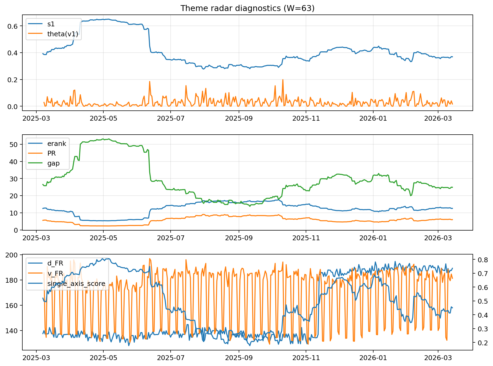

# Theme Radar Daily Brief — 2026-03-14

## Leaders (v1) — W=63
- **Nuclear_Uranium** (0.0867056777487396)
- Semis (0.0666426706026036)
- Quantum (0.0593032034876809)

## Challengers — W=63
**v2:** Rates (0.101103383156591), Software_Cloud (0.0756758607518735), DataCenter_Infra (0.0599929867050055)
**v3:** Metals (0.0962999283988436), Nuclear_Uranium (0.0661358700552233), MegaCap_AI (0.05885825141748)

## Migration (20D slope) — W=63
**Top risers:**
- axis_Genomics_Bio: 0.0003004856283437
- axis_MegaCap_AI: 0.0002869438819129
- axis_DataCenter_Infra: 0.000285014096951
- axis_Grid_Power: 0.0002471412114639
- axis_Credit: 0.0002038888568718
- axis_Critical_Minerals: 0.0001409688755598
- axis_Sector_Health: 0.000136522333218
- axis_Semis: 0.0001324900321866
- axis_Miners: 0.0001193969460005
- axis_USD: 0.0001043134246001

**Top fallers:**
- axis_Crypto: -8.124834980253594e-05
- axis_Sector_Energy: -9.857407388922764e-05
- axis_Defense: -0.0001505429424828
- axis_Space: -0.0001694253988018
- axis_Quantum: -0.0001953328732277
- axis_Rates: -0.0002280467503147
- axis_Cyber: -0.0002926808067952
- axis_Commodities: -0.0003576732307085
- axis_Software_Cloud: -0.0003698945675176
- axis_Drones_Autonomy: -0.0005624964950713

## Risk line (W=63)
- s1: 0.3690994716995454
- theta_v1: 0.0164554950485029
- v_FR: 181.3422398169365
- single_axis_score: 0.450402144772118

## Interpretation
**Regime:** `theme_migration`

- Action: Tomorrow watchlist: Genomics_Bio, MegaCap_AI, DataCenter_Infra, Grid_Power, Credit + v2_top1=Rates
- Action: Hedge note: normal correlation stability.

- Percentiles (W=63 history): vfr_pct=0.52, theta_pct=0.44, s1_pct=0.43, score_pct=0.44.

---
**BUNDLE_ROOT_SHA256:** `381b3cf8dd3bfcd83a0591f437edb0cc245fc62d9339dfe6dc990a7ad6362f6d`
