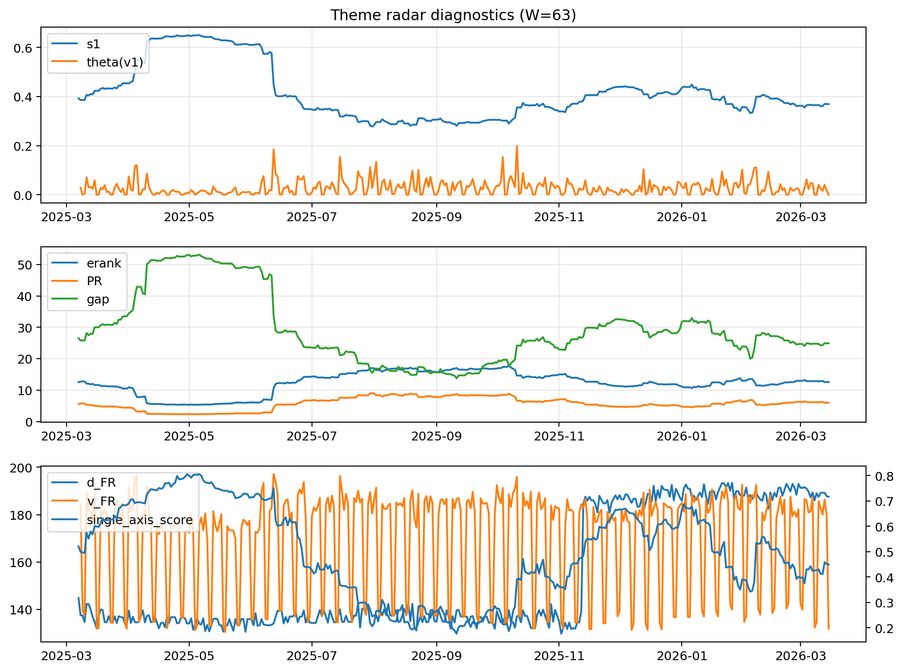

# Theme Radar Daily Brief — 2026-03-15

## Leaders (v1) — W=63
- **Nuclear_Uranium** (0.0867061524621346)
- Semis (0.0666426903592141)
- Quantum (0.0593037259902308)

## Challengers — W=63
**v2:** Rates (0.1010949152821342), Software_Cloud (0.0756999083675292), DataCenter_Infra (0.0599938201146192)
**v3:** Metals (0.0962920821434737), Nuclear_Uranium (0.0661457502209883), MegaCap_AI (0.058844647263889)

## Migration (20D slope) — W=63
**Top risers:**
- axis_Genomics_Bio: 0.0003881390486416
- axis_MegaCap_AI: 0.0003024195470519
- axis_DataCenter_Infra: 0.0002929271919309
- axis_Grid_Power: 0.0002431249420795
- axis_Credit: 0.0002180890063694
- axis_Sector_Health: 0.0001802586573221
- axis_Critical_Minerals: 0.000141479310829
- axis_Semis: 0.0001279991708442
- axis_USD: 0.0001254677641236
- axis_Miners: 0.0001212098068801

**Top fallers:**
- axis_Sector_Energy: -9.275372922786944e-05
- axis_Crypto: -0.000109351914102
- axis_Defense: -0.0001491098122588
- axis_Space: -0.0001759555667941
- axis_Quantum: -0.0002042516027074
- axis_Rates: -0.000284509290574
- axis_Cyber: -0.0002953790094132
- axis_Commodities: -0.0003269077468198
- axis_Software_Cloud: -0.0003822467297198
- axis_Drones_Autonomy: -0.000556033745861

## Risk line (W=63)
- s1: 0.3690978783301039
- theta_v1: 1.8843630433962717e-05
- v_FR: 131.86128815941066
- single_axis_score: 0.4497326203208556

## Interpretation
**Regime:** `theme_migration`

- Action: Tomorrow watchlist: Genomics_Bio, MegaCap_AI, DataCenter_Infra, Grid_Power, Credit + v2_top1=Rates
- Action: Hedge note: normal correlation stability.

- Percentiles (W=63 history): vfr_pct=0.02, theta_pct=0.01, s1_pct=0.43, score_pct=0.43.

---
**BUNDLE_ROOT_SHA256:** `fd83ff36c948f290c9b07a2cad45bdaaf529c023c5bad5feefb4b04562eeb180`
