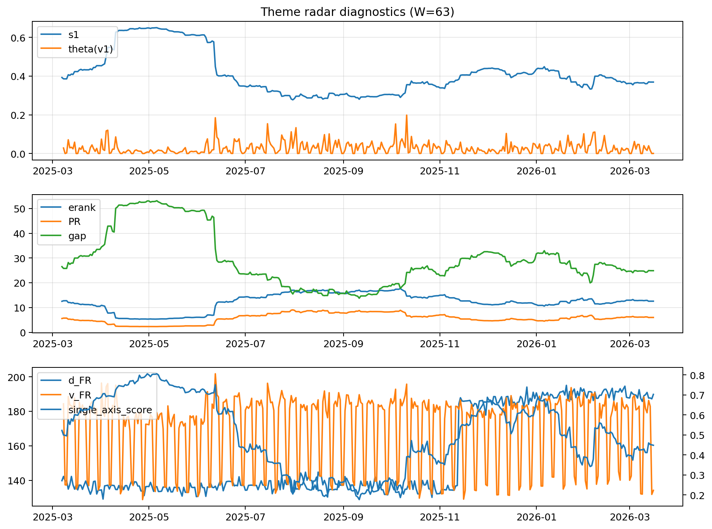

# Theme Radar Daily Brief — 2026-03-16

## Leaders (v1) — W=63
- **Nuclear_Uranium** (0.0867186273115844)
- Semis (0.0666504000112346)
- Quantum (0.0593096609223712)

## Challengers — W=63
**v2:** Rates (0.101074857078269), Software_Cloud (0.07573952124331), DataCenter_Infra (0.0600233517313327)
**v3:** Metals (0.0962640551980516), Nuclear_Uranium (0.0661469447596058), MegaCap_AI (0.0588270950387835)

## Migration (20D slope) — W=63
**Top risers:**
- axis_Genomics_Bio: 0.000427210092867
- axis_MegaCap_AI: 0.000317395260868
- axis_DataCenter_Infra: 0.0002819112333446
- axis_Grid_Power: 0.0002482105043082
- axis_Credit: 0.0002305662347289
- axis_Sector_Health: 0.0002048933016527
- axis_USD: 0.0001370033048971
- axis_Semis: 0.0001336822155266
- axis_Critical_Minerals: 0.0001210611257145
- axis_Miners: 0.0001070605907503

**Top fallers:**
- axis_Crypto: -0.0001115796203202
- axis_Nuclear_Uranium: -0.0001169226199364
- axis_Defense: -0.0001414061664821
- axis_Space: -0.0001841348535543
- axis_Quantum: -0.0002070835595051
- axis_Cyber: -0.0002867268467466
- axis_Commodities: -0.0003000676005608
- axis_Rates: -0.0003232558245648
- axis_Software_Cloud: -0.0003844687426507
- axis_Drones_Autonomy: -0.0005370927849626

## Risk line (W=63)
- s1: 0.3690293163622899
- theta_v1: 0.0006451514311098
- v_FR: 134.21503420478305
- single_axis_score: 0.4485333333333333

## Interpretation
**Regime:** `theme_migration`

- Action: Tomorrow watchlist: Genomics_Bio, MegaCap_AI, DataCenter_Infra, Grid_Power, Credit + v2_top1=Rates
- Action: Hedge note: normal correlation stability.

- Percentiles (W=63 history): vfr_pct=0.07, theta_pct=0.18, s1_pct=0.43, score_pct=0.43.

---
**BUNDLE_ROOT_SHA256:** `ef2551d86d5ac67835c86ad851ff07e3667d44a84c08f4ae3f7c4e0784810401`
