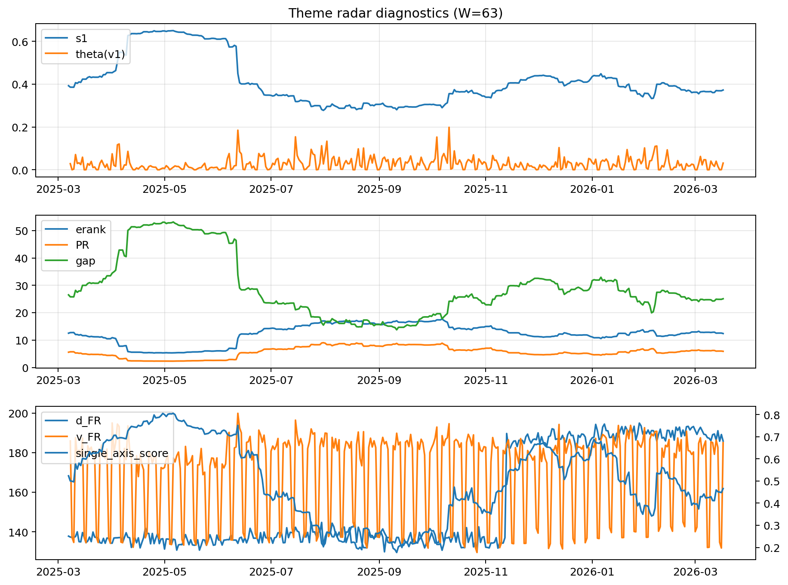

# Theme Radar Daily Brief — 2026-03-17

## Leaders (v1) — W=63
- **Nuclear_Uranium** (0.0862710783855395)
- Semis (0.0662545902000295)
- Genomics_Bio (0.0586160292438235)

## Challengers — W=63
**v2:** Rates (0.1037098470592628), Software_Cloud (0.0652389018268039), DataCenter_Infra (0.0582561024166886)
**v3:** Metals (0.0991297846105805), Software_Cloud (0.0678223829361287), Nuclear_Uranium (0.0658911104332984)

## Migration (20D slope) — W=63
**Top risers:**
- axis_Genomics_Bio: 0.00047528282113
- axis_MegaCap_AI: 0.0003549817814678
- axis_DataCenter_Infra: 0.0002838936083196
- axis_Grid_Power: 0.0002542675756656
- axis_Credit: 0.0002426600260148
- axis_Sector_Health: 0.0002266401842927
- axis_USD: 0.0001480532366766
- axis_Semis: 0.0001230342788858
- axis_Sector_Comm: 0.0001129609229609
- axis_Sector_RealEstate: 0.0001041074341062

**Top fallers:**
- axis_Crypto: -0.0001136746824725
- axis_Defense: -0.0001324621353874
- axis_Nuclear_Uranium: -0.0001592348142254
- axis_Space: -0.0001935312758019
- axis_Quantum: -0.0002125082396517
- axis_Commodities: -0.0002751472619227
- axis_Cyber: -0.0002865171980471
- axis_Rates: -0.0003617588826637
- axis_Software_Cloud: -0.0003718271807502
- axis_Drones_Autonomy: -0.0005181933703832

## Risk line (W=63)
- s1: 0.3725294162668014
- theta_v1: 0.031235106880133
- v_FR: 185.01022412509255
- single_axis_score: 0.4659574468085107

## Interpretation
**Regime:** `theme_migration`

- Action: Tomorrow watchlist: Genomics_Bio, MegaCap_AI, DataCenter_Infra, Grid_Power, Credit + v2_top1=Rates
- Action: Hedge note: normal correlation stability.

- Percentiles (W=63 history): vfr_pct=0.74, theta_pct=0.66, s1_pct=0.46, score_pct=0.47.

---
**BUNDLE_ROOT_SHA256:** `896cad171351355bb81fc5ae7accfbf4d21882a9b3c5a900b1a53ed101b0917f`
