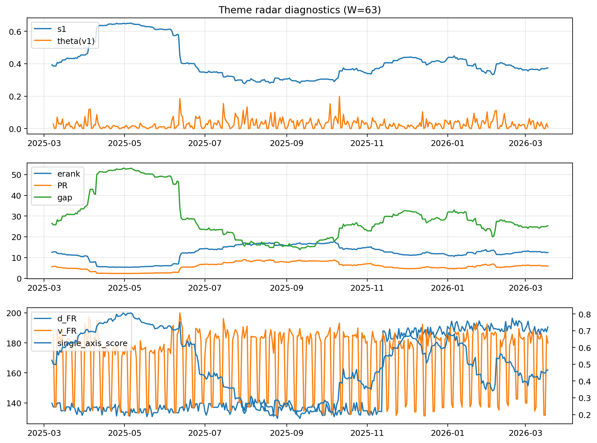

# Theme Radar Daily Brief — 2026-03-18

## Leaders (v1) — W=63
- **Nuclear_Uranium** (0.0863405363244275)
- Semis (0.0659769135779656)
- Genomics_Bio (0.058632337673281)

## Challengers — W=63
**v2:** Rates (0.0998354369138274), Software_Cloud (0.0705391546281435), DataCenter_Infra (0.0580107639926298)
**v3:** Metals (0.1001781296036832), Nuclear_Uranium (0.068159453904015), Software_Cloud (0.0623675110631601)

## Migration (20D slope) — W=63
**Top risers:**
- axis_Genomics_Bio: 0.0004906922946688
- axis_MegaCap_AI: 0.000401876756246
- axis_DataCenter_Infra: 0.0002776141531098
- axis_Credit: 0.0002531657916926
- axis_Grid_Power: 0.0002400367781443
- axis_Sector_Health: 0.0002379275108594
- axis_USD: 0.0001574959972516
- axis_Sector_Comm: 0.0001332596148139
- axis_Semis: 0.0001145597557563
- axis_Sector_RealEstate: 0.0001060650642524

**Top fallers:**
- axis_Crypto: -0.0001105645962207
- axis_Defense: -0.0001309086198719
- axis_Nuclear_Uranium: -0.0002015843997687
- axis_Quantum: -0.0002052199819746
- axis_Space: -0.0002058510177033
- axis_Commodities: -0.0002484885839962
- axis_Cyber: -0.0002700731585876
- axis_Software_Cloud: -0.0003364545054614
- axis_Rates: -0.0003745648652773
- axis_Drones_Autonomy: -0.0004896840423729

## Risk line (W=63)
- s1: 0.3742807349167482
- theta_v1: 0.0103401570789993
- v_FR: 179.99080821141325
- single_axis_score: 0.4652519893899204

## Interpretation
**Regime:** `theme_migration`

- Action: Tomorrow watchlist: Genomics_Bio, MegaCap_AI, DataCenter_Infra, Credit, Grid_Power + v2_top1=Rates
- Action: Hedge note: normal correlation stability.

- Percentiles (W=63 history): vfr_pct=0.47, theta_pct=0.34, s1_pct=0.47, score_pct=0.47.

---
**BUNDLE_ROOT_SHA256:** `6004521b7b8ae2b7160c1475d4d088c1b5503de19c1740b29dadc7488fd99215`
