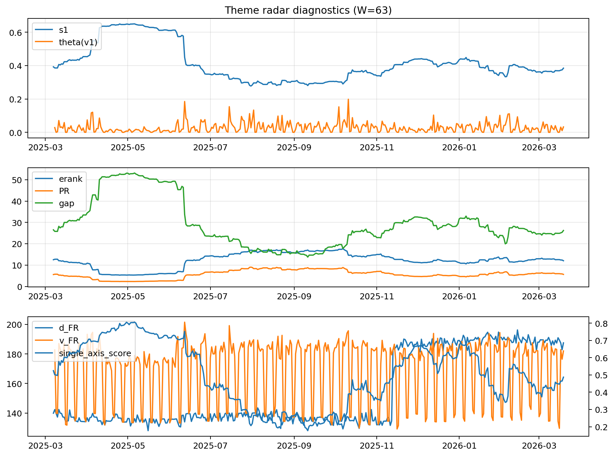

# Theme Radar Daily Brief — 2026-03-19

## Leaders (v1) — W=63
- **Nuclear_Uranium** (0.0846958296108786)
- Semis (0.0656531170375531)
- Genomics_Bio (0.058406778635027)

## Challengers — W=63
**v2:** Rates (0.1013840108996803), Software_Cloud (0.0668395399519262), Quantum (0.0609665905789094)
**v3:** Metals (0.1020702749307039), Software_Cloud (0.0700103901617714), Nuclear_Uranium (0.066880417592116)

## Migration (20D slope) — W=63
**Top risers:**
- axis_Genomics_Bio: 0.0004639868084802
- axis_MegaCap_AI: 0.0004524987954872
- axis_DataCenter_Infra: 0.0002777853053599
- axis_Credit: 0.0002695518695308
- axis_Sector_Health: 0.0002539044713583
- axis_Grid_Power: 0.0002206424195247
- axis_USD: 0.0001698043618116
- axis_Sector_Comm: 0.0001604332401087
- axis_Sector_RealEstate: 0.0001158924602578
- axis_Vol: 9.699489332915544e-05

**Top fallers:**
- axis_Defense: -0.0001315533438649
- axis_Metals: -0.0001603714150363
- axis_Space: -0.0002049286005024
- axis_Commodities: -0.0002193458497972
- axis_Quantum: -0.0002431681370537
- axis_Nuclear_Uranium: -0.0002509418069517
- axis_Cyber: -0.0002638721956495
- axis_Software_Cloud: -0.0003081413201783
- axis_Rates: -0.0003722455811463
- axis_Drones_Autonomy: -0.0004518013161816

## Risk line (W=63)
- s1: 0.3845745292533262
- theta_v1: 0.0325428884589832
- v_FR: 182.027760914236
- single_axis_score: 0.4873015873015872

## Interpretation
**Regime:** `theme_migration`

- Action: Tomorrow watchlist: Genomics_Bio, MegaCap_AI, DataCenter_Infra, Credit, Sector_Health + v2_top1=Rates
- Action: Hedge note: normal correlation stability.

- Percentiles (W=63 history): vfr_pct=0.57, theta_pct=0.68, s1_pct=0.49, score_pct=0.49.

---
**BUNDLE_ROOT_SHA256:** `41e20aa7f3ba4c006fb8d6a966746908fbf124a205e2ae50da78373593ca20b8`
