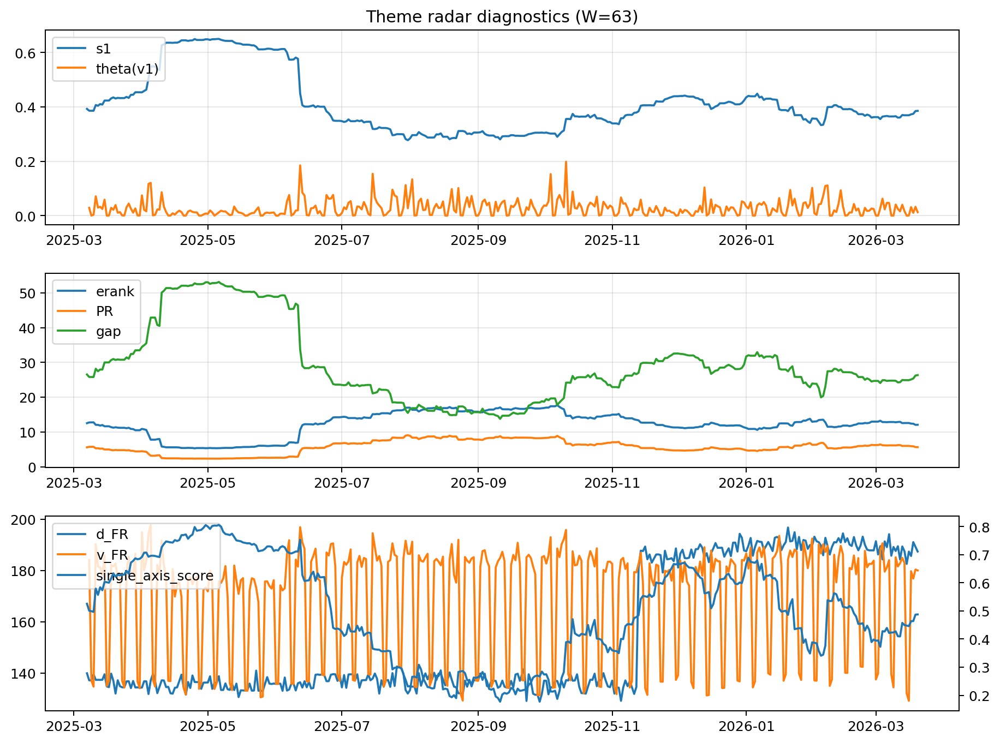

# Theme Radar Daily Brief — 2026-03-20

## Leaders (v1) — W=63
- **Nuclear_Uranium** (0.0849151588532097)
- Semis (0.0663404901400004)
- Genomics_Bio (0.0596344464078243)

## Challengers — W=63
**v2:** Rates (0.1051122646100014), Software_Cloud (0.0674032100820269), Quantum (0.0598305940846765)
**v3:** Metals (0.1022513797071635), Nuclear_Uranium (0.0697393967650911), Software_Cloud (0.0687737896891099)

## Migration (20D slope) — W=63
**Top risers:**
- axis_MegaCap_AI: 0.0004981320176838
- axis_Genomics_Bio: 0.000448846767779
- axis_Credit: 0.0002709322812446
- axis_DataCenter_Infra: 0.0002528704608386
- axis_Sector_Health: 0.0002507789268365
- axis_Grid_Power: 0.0001953748292165
- axis_Sector_Comm: 0.0001746399182678
- axis_USD: 0.0001705156642009
- axis_Sector_RealEstate: 0.0001178532506739
- axis_Sector_ConsDisc: 0.0001018806756699

**Top fallers:**
- axis_Defense: -0.0001332642353127
- axis_Commodities: -0.0002014648244167
- axis_Space: -0.0002027359173838
- axis_Metals: -0.0002027546216967
- axis_Cyber: -0.0002414922173861
- axis_Quantum: -0.0002533250966605
- axis_Software_Cloud: -0.0002611580502645
- axis_Nuclear_Uranium: -0.000287932789844
- axis_Rates: -0.0003470164488072
- axis_Drones_Autonomy: -0.0003985127386806

## Risk line (W=63)
- s1: 0.3853499217667343
- theta_v1: 0.0127087529863198
- v_FR: 180.01653539599505
- single_axis_score: 0.487598944591029

## Interpretation
**Regime:** `theme_migration`

- Action: Tomorrow watchlist: MegaCap_AI, Genomics_Bio, Credit, DataCenter_Infra, Sector_Health + v2_top1=Rates
- Action: Hedge note: normal correlation stability.

- Percentiles (W=63 history): vfr_pct=0.48, theta_pct=0.40, s1_pct=0.50, score_pct=0.49.

---
**BUNDLE_ROOT_SHA256:** `c04c5f90053ffeda5b9db00632c43495eca7a363a25f1841a7adf73cadd19c53`
