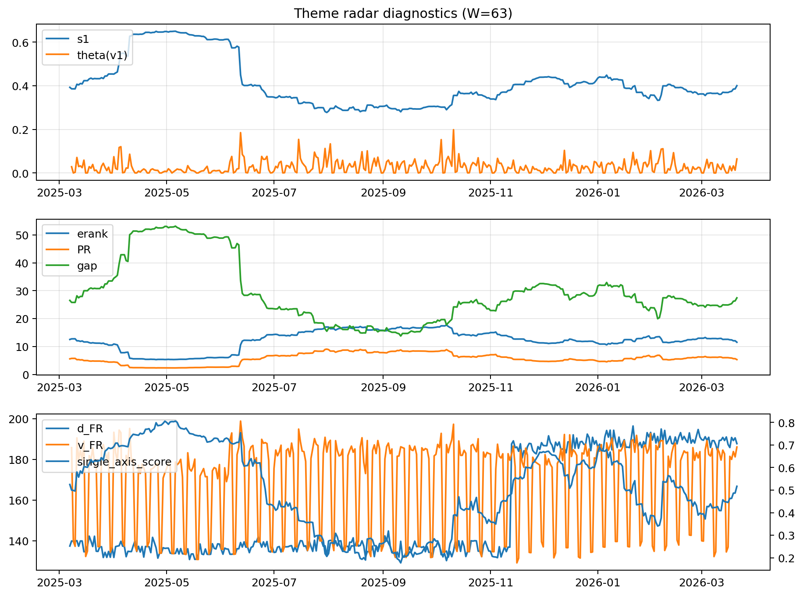

# Theme Radar Daily Brief — 2026-03-21

## Leaders (v1) — W=63
- **Nuclear_Uranium** (0.0820176632649795)
- Semis (0.0651217973379089)
- Genomics_Bio (0.0575793213989407)

## Challengers — W=63
**v2:** Rates (0.1120839009093999), Quantum (0.0650818330158983), Software_Cloud (0.0647486219022104)
**v3:** Metals (0.1060037647385985), Software_Cloud (0.0732534430198973), Nuclear_Uranium (0.0694547981879759)

## Migration (20D slope) — W=63
**Top risers:**
- axis_MegaCap_AI: 0.000538513768995
- axis_Genomics_Bio: 0.0003912090669389
- axis_Credit: 0.0002933630505836
- axis_DataCenter_Infra: 0.0002470546698075
- axis_Sector_Health: 0.000246113644568
- axis_Sector_Comm: 0.000190634852479
- axis_USD: 0.0001688885205643
- axis_Grid_Power: 0.0001596471692778
- axis_Sector_RealEstate: 0.0001352756337042
- axis_Sector_ConsDisc: 0.0001117060109581

**Top fallers:**
- axis_Defense: -0.0001326836202874
- axis_Commodities: -0.0001741601047083
- axis_Rates: -0.0001776563819277
- axis_Space: -0.0002018317698708
- axis_Cyber: -0.0002060327750066
- axis_Software_Cloud: -0.0002067755442966
- axis_Metals: -0.0002500122375653
- axis_Quantum: -0.0002994864041275
- axis_Drones_Autonomy: -0.0003241789451931
- axis_Nuclear_Uranium: -0.0003593817488872

## Risk line (W=63)
- s1: 0.4002921890429169
- theta_v1: 0.0643808987978473
- v_FR: 186.10038700097144
- single_axis_score: 0.5168421052631579

## Interpretation
**Regime:** `theme_migration`

- Action: Tomorrow watchlist: MegaCap_AI, Genomics_Bio, Credit, DataCenter_Infra, Sector_Health + v2_top1=Rates
- Action: Hedge note: normal correlation stability.

- Percentiles (W=63 history): vfr_pct=0.81, theta_pct=0.90, s1_pct=0.56, score_pct=0.53.

---
**BUNDLE_ROOT_SHA256:** `bc18b4cbd0190b73c6e7526a8818c07d8e662434993383cd952e0c9ef73895f6`
