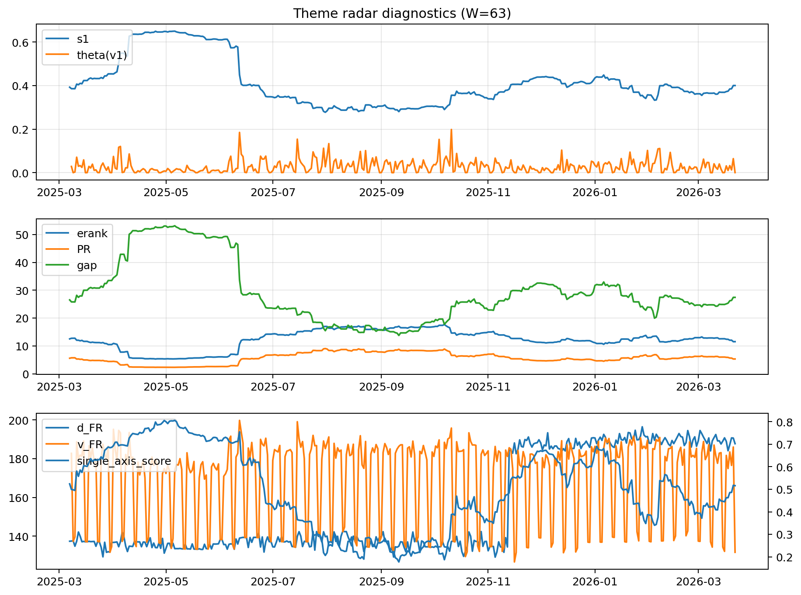

# Theme Radar Daily Brief — 2026-03-22

## Leaders (v1) — W=63
- **Nuclear_Uranium** (0.0820247772249302)
- Semis (0.0651302702060121)
- Genomics_Bio (0.0575851896001467)

## Challengers — W=63
**v2:** Rates (0.1121121985446767), Quantum (0.0650759099000709), Software_Cloud (0.0646510844262118)
**v3:** Metals (0.1060340133835477), Software_Cloud (0.0734057439452362), Nuclear_Uranium (0.069401150273476)

## Migration (20D slope) — W=63
**Top risers:**
- axis_MegaCap_AI: 0.0005665909008653
- axis_Genomics_Bio: 0.0003235392616496
- axis_Credit: 0.0003057952555664
- axis_Sector_Health: 0.0002340461356175
- axis_DataCenter_Infra: 0.0002315073519458
- axis_Sector_Comm: 0.0002013069566096
- axis_USD: 0.0001630724893964
- axis_Sector_RealEstate: 0.0001468240483957
- axis_Grid_Power: 0.0001204939233114
- axis_Sector_ConsDisc: 0.0001188784899501

**Top fallers:**
- axis_Defense: -0.0001282997442138
- axis_Commodities: -0.0001402714064679
- axis_Software_Cloud: -0.0001442211028148
- axis_Crypto: -0.0001560192456565
- axis_Cyber: -0.0001627268170442
- axis_Space: -0.0001960588889011
- axis_Drones_Autonomy: -0.0002384881811889
- axis_Metals: -0.0002939003012827
- axis_Quantum: -0.0003347586884162
- axis_Nuclear_Uranium: -0.0004195574316183

## Risk line (W=63)
- s1: 0.4002225020998718
- theta_v1: 0.0006308741017352
- v_FR: 131.70900072473287
- single_axis_score: 0.5160104986876639

## Interpretation
**Regime:** `theme_migration`

- Action: Tomorrow watchlist: MegaCap_AI, Genomics_Bio, Credit, Sector_Health, DataCenter_Infra + v2_top1=Rates
- Action: Hedge note: normal correlation stability.

- Percentiles (W=63 history): vfr_pct=0.02, theta_pct=0.17, s1_pct=0.56, score_pct=0.53.

---
**BUNDLE_ROOT_SHA256:** `cb5974b8e49248912cda7f3e95bc8ff6d31ca4cd8c8f71c582d37a1301044efd`
