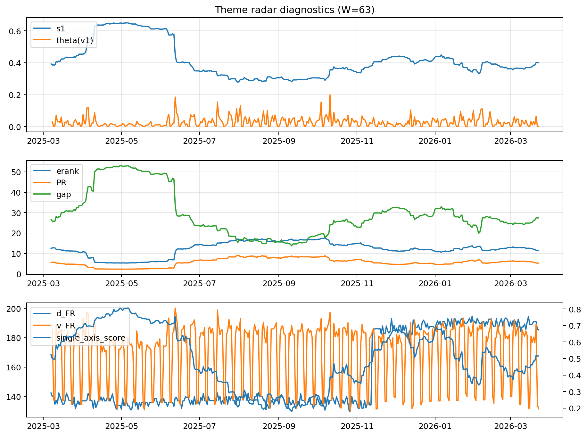

# Theme Radar Daily Brief — 2026-03-23

## Leaders (v1) — W=63
- **Nuclear_Uranium** (0.082028417676082)
- Semis (0.0651318850674078)
- Genomics_Bio (0.0575881940326834)

## Challengers — W=63
**v2:** Rates (0.1121238979859686), Quantum (0.0650547403132495), Software_Cloud (0.0646526919829494)
**v3:** Metals (0.1060324570327774), Software_Cloud (0.0733789699003682), Nuclear_Uranium (0.0694111564707603)

## Migration (20D slope) — W=63
**Top risers:**
- axis_MegaCap_AI: 0.0005816898303696
- axis_Credit: 0.0003074420560461
- axis_Genomics_Bio: 0.000243510628598
- axis_Sector_Health: 0.0002109538471463
- axis_DataCenter_Infra: 0.0002079810806245
- axis_Sector_Comm: 0.0002059919035391
- axis_Sector_RealEstate: 0.0001537440293922
- axis_USD: 0.0001454433522985
- axis_Rates: 0.0001360112708105
- axis_Sector_ConsDisc: 0.0001167613678327

**Top fallers:**
- axis_Miners: -0.0001232475130642
- axis_Defense: -0.0001242945516643
- axis_Clean_Broad: -0.0001271330658289
- axis_Critical_Minerals: -0.0001595570153136
- axis_Drones_Autonomy: -0.0001689040547672
- axis_Crypto: -0.0001693126226105
- axis_Space: -0.0001786141422279
- axis_Metals: -0.0003211240544862
- axis_Quantum: -0.0003392712790792
- axis_Nuclear_Uranium: -0.0004602898195953

## Risk line (W=63)
- s1: 0.4002061582061176
- theta_v1: 6.029351218494204e-05
- v_FR: 131.57142200107666
- single_axis_score: 0.5162303664921466

## Interpretation
**Regime:** `theme_migration`

- Action: Tomorrow watchlist: MegaCap_AI, Credit, Genomics_Bio, Sector_Health, DataCenter_Infra + v2_top1=Rates
- Action: Hedge note: normal correlation stability.

- Percentiles (W=63 history): vfr_pct=0.01, theta_pct=0.03, s1_pct=0.56, score_pct=0.53.

---
**BUNDLE_ROOT_SHA256:** `70a62e848e82424847ce020d37318f781b56ce4119ae37754a4af232fbcbff60`
